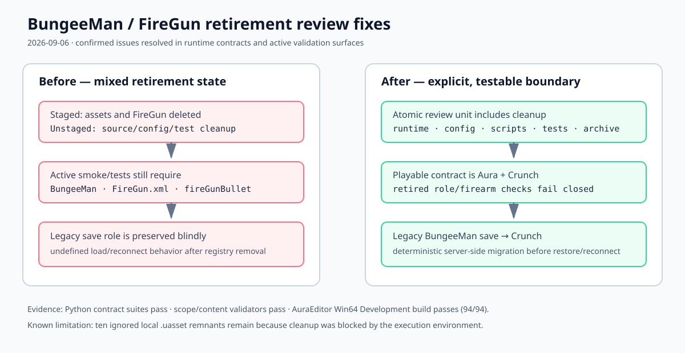

# BungeeMan / FireGun retirement review fixes — 2026-09-06

## Intent

Review the supplied retirement packet against the checkout, fix confirmed runtime/validation issues, and keep the staged review unit coherent.

## Changed behavior

- The playable candidate contract now names Aura and Crunch across its frozen scope, runner, tutorial, and content validators.
- Active Day 19/20/7–9 checks no longer require the retired BungeeMan role, `FireGun.xml`, or `fireGunBullet`; the retained firearm code remains a compatibility boundary.
- Legacy saves containing `BungeeMan` migrate deterministically to `Crunch` before profile restoration.
- The active role catalog and role-switch tests now assert the retired role is rejected while Aura, Crunch, and Civilian remain available.

## Validation

- `python Scripts/test_playable_candidate.py --days all --mode Both` — pass, 20 tests.
- `python Scripts/test_removed_bungeeman_role.py` — blocked by ten ignored local `.uasset` remnants under `Content/BungeeMan`.
- `python Scripts/test_role_battle_days_7_9.py` — pass.
- `python Scripts/test_role_battle_days_19.py` — pass, 14 checks.
- `python Scripts/test_role_battle_days_20.py` — pass.
- `ValidatePlayableCandidateScope.ps1` — pass.
- `ValidatePlayableCandidateContent.ps1 -AsJson` — pass, with three non-ability XML warnings.
- AuraEditor Win64 Development build — pass, 94/94 actions.

Packaged listen/dedicated cook and binary reference scans were not run in this environment. The ignored local remnants must be removed after any locking editor process releases them before treating content-absence validation as authoritative.

[Open the before/after diagram](./2026-09-06-bungeeman-retirement-review-fix.svg)
