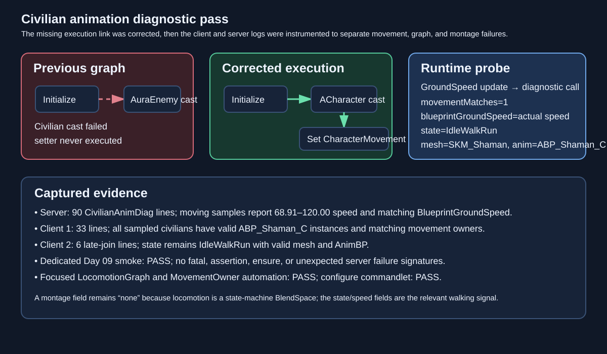

# Civilian animation diagnostics

Date: 2026-09-06  
Intent: Add enough runtime evidence to distinguish a missing movement-owner update from a state-machine or animation-asset problem after the first fix did not resolve the visible walking issue.

## Changed behavior

The inherited `ABP_Enemy` graph now routes the `ACharacter` cast's execution output into `Set CharacterMovement`; the earlier change only rewired the data pin, leaving the setter behind the failed `AuraEnemy` execution path. A throttled `CivilianAnimDiag` Blueprint function now records the pawn role/class, cached-versus-actual movement component, movement mode and speed, Blueprint `GroundSpeed`, mesh, AnimBP class, anim-instance validity, current state, and montage status. State logging is guarded against uninitialized server state machines.

## Validation and findings

- `build_test.bat`: passed.
- `AuraConfigureCivilianAnimBlueprint`: passed; `Saved/Reports/Civilian/civilian-anim-blueprint-configure.json` records `enemyMovementConfigured=true`.
- `Aura.RoleBattle.Civilian.Presentation` automation: 2/2 passed, including the execution-link and diagnostic-node assertions.
- `RunRoleBattleCivilianNetworkSmoke.ps1 -Day 9 -Mode Dedicated -Port 17913`: passed on the final binary.
- Runtime logs contain `CivilianAnimDiag` samples: Server 90, Client1 33, Client2 6; moving samples show `cachedMovement=1`, `movementMatches=1`, valid `SKM_Shaman`/`ABP_Shaman_C`, equal actual and Blueprint speeds, and `state=IdleWalkRun`.
- Runtime logs contain zero fatal/assertion/ensure signatures. `montage=none` is expected for this locomotion state machine, which uses a BlendSpace rather than a montage.
- In-app Claude review was unavailable after two bounded browser attempts; local Unreal build, commandlet, automation, and two-client runtime logs are the fallback review path.

