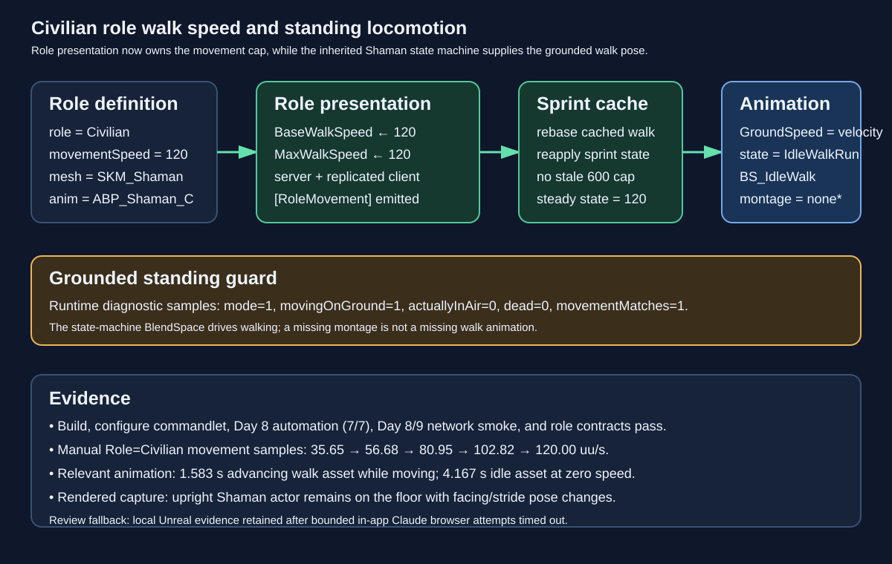

# Civilian role walk speed and standing locomotion

Date: 2026-09-06  
Intent: Resolve the Civilian-as-Role movement speed mismatch and verify that the inherited Shaman locomotion graph is evaluating while the character is grounded and alive.

## Changed behavior

`FRoleDefaultInfo` now carries an optional `movementSpeed` value. The role parser validates it, and `RoleConfig.json` sets Civilian to 120 uu/s while preserving 600 uu/s for the player combat roles. `AAuraCharacterBase::ApplyRolePresentationFromDefinition` applies the role value to both `BaseWalkSpeed` and `CharacterMovement->MaxWalkSpeed`, then rebases the player controller sprint cache so a late Civilian role presentation cannot retain the old 600 uu/s cap. Runtime `[RoleMovement]` lines identify the server/client owner, role, previous cap, and applied cap.

The existing `ABP_Enemy` generic `ACharacter` movement-owner path and `ABP_Shaman` parent update call remain the locomotion path. The diagnostic now reports `movingOnGround`, `actuallyInAir`, and `dead` alongside the current `Main States` state and the relevant animation time/length. Civilian movement is driven by the `IdleWalkRun` state machine and `BS_IdleWalk` BlendSpace; `montage=none` is therefore expected for walking.

## Validation and findings

- `build_test.bat`: passed after the movement-speed and sprint-cache changes.
- `AuraConfigureCivilianAnimBlueprint`: passed; report records `configured=true`, `enemyMovementConfigured=true`, and enabled update/parent nodes.
- `Scripts/test_role_battle_days_7_9.py`: passed.
- `RunRoleBattleDays789Automation.ps1 -Day 8 -Mode Dedicated`: passed 7/7, including `Day8.CivilianRoleMovementApplicationContract`.
- Day 8 and Day 9 dedicated civilian network smoke runs: passed.
- Server and client logs for `Role=Civilian` show the steady-state cap at `maxWalkSpeed=120.0`; moving samples reach exactly 120.00 and then decelerate. Every moving sample reports `movementMatches=1`, `mode=1`, `movingOnGround=1`, `actuallyInAir=0`, `dead=0`, valid `SKM_Shaman`/`ABP_Shaman_C`, and `state=IdleWalkRun`.
- The new relevant-animation probe reports `relevantAnimLength=1.583` with advancing `relevantAnimTime` while the Civilian moves, versus the idle `4.167` second asset at zero speed. This confirms the walking BlendSpace contribution is active even though no montage is playing.
- Rendered Civilian-role capture `Saved/VisualCheckCivilianRoleSpeedFixContact.png` shows the same upright actor across movement frames with facing/stride pose changes. The capture is supported by `VisualCheck-CivilianRole-Manual.log`, whose movement samples are 36.17, 58.30, 86.21, 110.09, and 120.00 uu/s under the 120 uu/s cap.
- No fatal, assertion, ensure, or unexpected server failure signatures were found in the dedicated logs.
- The in-app Claude review surface was unavailable after two bounded browser attempts (no usable native app window and the browser call timed out), so the Unreal build, commandlet, automation, dedicated logs, and rendered capture are the documented local fallback.

