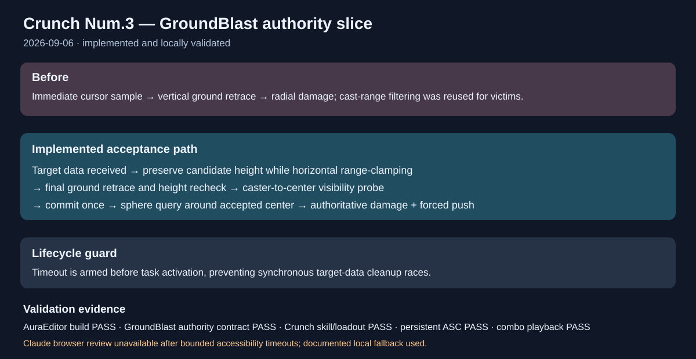

# Crunch Num.3 GroundBlast authority slice

Date: 2026-09-06.

## Intent

Start implementation of the Num.3 GroundBlast plan by closing authority-side target acceptance and activation-order gaps without changing role grants or the input mapping.

## Changed behavior

- GroundBlast arms its timeout before activating montage or target-data tasks, so a synchronous replicated target-data callback cannot race deadline registration.
- Horizontal out-of-range requests are clamped while preserving the requested Z before validation; the final retraced ground point is height-checked again.
- A caster-to-center visibility probe rejects an earlier obstruction while allowing the supporting ground hit to terminate the probe.
- Victim overlap is evaluated relative to the accepted blast center without applying the caster center range a second time.
- Center-overlapping targets receive a deterministic forward push direction, and Crunch knockback is marked as an explicit 100% application when a nonzero impact velocity is authored.
- Added `Aura.Migration.Crunch.GroundBlast.AuthorityContract` to freeze the Num.3 identity and tuning defaults.

The movable preview, explicit confirmation/cancellation input, replicated presentation, and dedicated-server gameplay runner remain in the next implementation slices described in the [Num.3 plan](../../Plans/Crunch-Num3-GroundBlast-Implementation-Plan-2026-09-06.md).

## Validation

- `AuraEditor Win64 Development` build passed (77/77 actions, exit 0).
- `Aura.Migration.Crunch.GroundBlast.AuthorityContract` passed.
- `Aura.Migration.Crunch.Skills` identity and role-loadout tests passed.
- `Aura.RoleBattle.Day6.CrunchPersistentASCLifecycle` passed.
- `Aura.Migration.CrunchCombo.RuntimePlayback` completed successfully with warning-only engine diagnostics.
- `RunCrunchMigration.ps1 -Stage Fast -Scenario GroundBlast` passed contract preflight.
- `git diff --check` passed.
- The in-app Claude handoff could not reach a usable signed-in/composer accessibility state after two bounded attempts; no repository evidence was transmitted, and local validation was used as the fallback.

## Illustration

