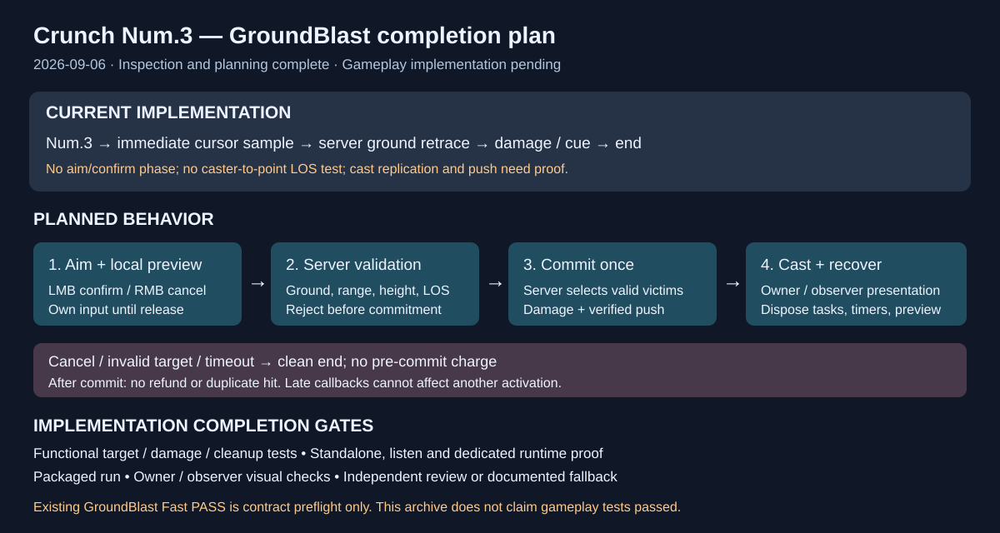

# Crunch Num.3 inspection and implementation plan

Date: 2026-09-06. Documentation-only job.

## Intent and result

Inspect the current Crunch role before planning completion of Num.3. Confirmed Num.3 is already the native GroundBlast startup ability; LMB and all four numbered skills have implementation source and role integration. The original source uses user-confirmed targeting with a moving decal, while the migrated ability samples the cursor immediately.

The [implementation plan](../../Plans/Crunch-Num3-GroundBlast-Implementation-Plan-2026-09-06.md) defines five dependency-ordered daily contracts for aiming/input, server validation and damage, replicated presentation, and runtime/package evidence. It distinguishes current code from proposed behavior and preflight checks from functional tests. Gameplay behavior was not changed in this job.

## Validation

- Inspected target native abilities, shared GAS boundary, cursor task, role and metadata JSON, existing automation, migration runner and original GroundBlast/target actor source.
- Reviewed the plan for concrete surfaces, authority, controls, fixtures, test names, commands, timeouts, evidence, completion gates and deferrals.
- Validated archive SVG XML and documentation whitespace; verified companion documents and index link exist.
- No engine build, live skill test or Blueprint edits were performed; implementation/runtime gates remain pending.

## Illustration

