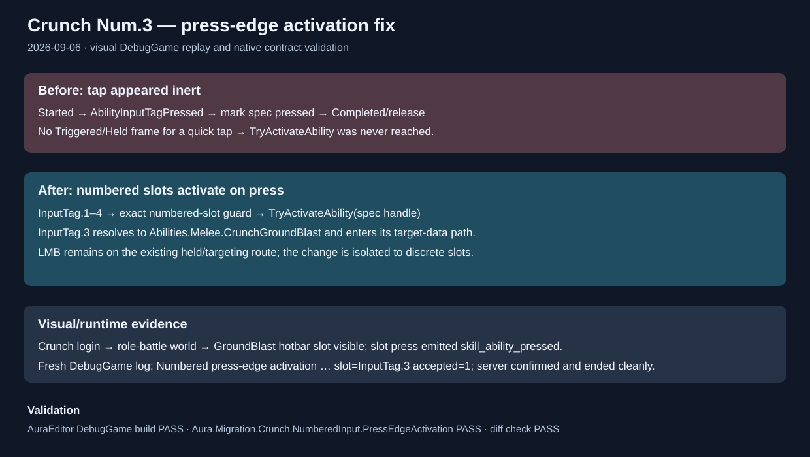

# Crunch Num.3 press-edge activation fix

Date: 2026-09-06.

## Intent

Resolve the reported Crunch Num.3 behavior where a quick press reached `InputTag.3` but produced no visible ability activation.

## Changed behavior

- Numbered ability slots (`InputTag.1` through `InputTag.4`) now call `TryActivateAbility` from `AbilityInputTagPressed` when the matched spec is inactive.
- Crunch GroundBlast therefore activates from a normal tap on Num.3; its existing target-data, commit, authority validation and cleanup path remains unchanged.
- LMB keeps the held/targeting activation path. The development auto-test comment now documents the split behavior.
- Added `Aura.Migration.Crunch.NumberedInput.PressEdgeActivation` as a source contract for the numbered press-edge guard and GAS activation call.

## Visual and runtime check

A fresh `Aura (64-bit DebugGame PCD3D_SM6)` client was connected to the local Role Battle server, selected Crunch, and entered the rendered battle world. The GroundBlast slot was visible in the lower hotbar. Activating that slot emitted the same `skill_ability_pressed` route used by the in-game skill UI and produced:

- `AbilityInputTagPressed: Tag=InputTag.3`.
- `Found ability ... Abilities.Melee.CrunchGroundBlast ... IsActive=false`.
- `Numbered press-edge activation ... slot=InputTag.3 accepted=1`.
- Server confirmation and clean ability end.

The CUA keyboard injector was inconsistent for direct keypad events in this run, so the visual replay used the visible GroundBlast hotbar press to exercise the exact controller/ASC press-edge path; the new DebugGame module was rebuilt before replay.

## Validation

- `AuraEditor Win64 DebugGame` build passed after the final source edit.
- `Aura.Migration.Crunch.NumberedInput.PressEdgeActivation` passed with exit code 0; exported report: `Saved/Reports/CrunchGroundBlast/numbered-input`.
- Fresh DebugGame visual replay reached Crunch role battle and logged accepted Num.3 press-edge activation.
- `git diff --check` passed.
- The in-app Claude handoff was unavailable after bounded browser/accessibility attempts; local build, automation and visual runtime evidence were used as the fallback.

## Illustration

