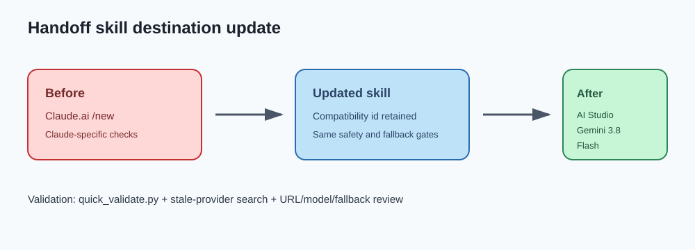

# Google AI Studio handoff skill update

## Intent

Switch the reusable in-app handoff destination from Claude.ai to Google AI Studio.

## Changed behavior

The compatibility-preserved `in-app-claude-handoff` skill now opens the exact Google AI Studio Gemini 3.8 Flash URL, verifies Google AI Studio sign-in and prompt composition, and labels returned output as a Google AI Studio browser result. Existing privacy, action-time confirmation, no-duplicate-send, and bounded local fallback rules remain in force.

## Validation

- Skill frontmatter and structure validated with `quick_validate.py`.
- Repository search confirms the skill no longer contains an operational Claude.ai destination.
- The URL, model, provider labels, and fallback destination were reviewed against the requested workflow.

