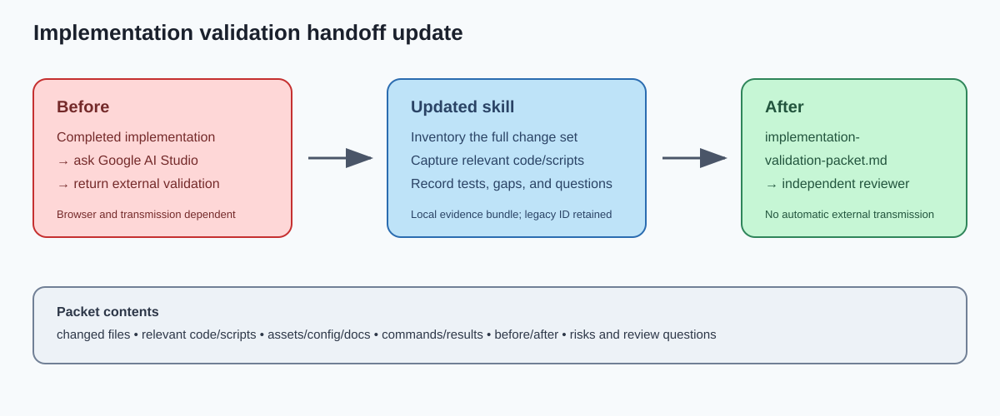

# Implementation validation packet skill update

## Intent

Replace the previous external Google AI Studio validation handoff with a local implementation-validation packet that preserves the complete change context for an independent reviewer.

## Changed behavior

- Preserved the `in-app-claude-handoff` skill identifier for compatibility.
- Updated the skill and its UI metadata to create `implementation-validation-packet.md` in the current task’s artifact/output directory.
- Required the packet to capture changed and created files, relevant code and scripts, assets/configuration/documentation, exact validation commands and results, before/after behavior, risks, blockers, and reviewer questions.
- Removed the operational browser, Google AI Studio, external-model, upload, and transmission workflow.

## Validation

- `python C:\Users\mickie\.codex\skills\.system\skill-creator\scripts\quick_validate.py C:\Users\mickie\.codex\skills\in-app-claude-handoff` — PASS (`Skill is valid!`).
- Read back the updated `SKILL.md` and `agents/openai.yaml`; packet path, changed-file inventory, relevant code/scripts, evidence, and safety boundaries are present.
- Searched the updated skill for browser/send/upload instructions; remaining provider references are explicit prohibitions or compatibility wording, not operational steps.

