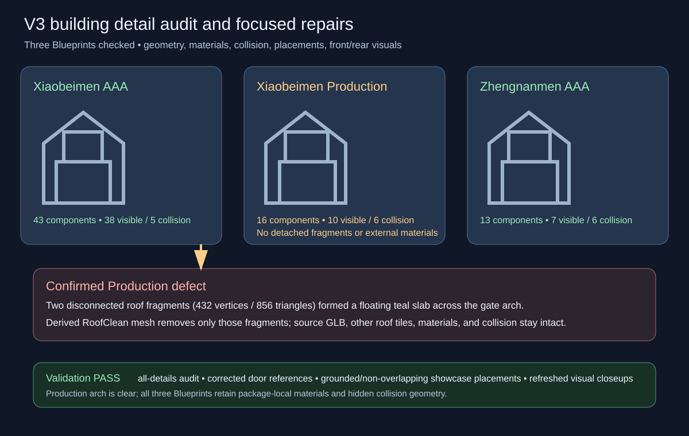

# V3 building detail audit

All three V3 gate Blueprints were checked for component completeness, placement, package-local materials, hidden collision separation, and front/rear visual coherence. Xiaobeimen AAA, Xiaobeimen Production, and Zhengnanmen AAA passed the focused audit with no detached visible fragments, no external material references, and grounded, non-overlapping showcase placements.

The audit confirmed one additional Production issue: two disconnected low roof fragments in the source roof mesh rendered as a floating teal slab through the inner arch. A derived `RoofClean` mesh removes only those two fragments (432 vertices and 856 triangles). The original source GLB remains unchanged. The Production Blueprint and saved preview/showcase maps now resolve the cleaned roof asset. The previously corrected wooden door leaves and metal studs remain aligned at the jambs.

Validation passed in the live Unreal editor: all three Blueprints retained their expected visible/collision component counts; materials stayed package-local; the Production Blueprint and preview level reference the corrected roof and door assets; showcase placement validation passed for all three actors. Refreshed front/rear and detail closeup captures were visually inspected. The older broad texture validator remains unsuitable as a gate because authored 32x32 height/ORM placeholder maps carry `_4K` filenames.

