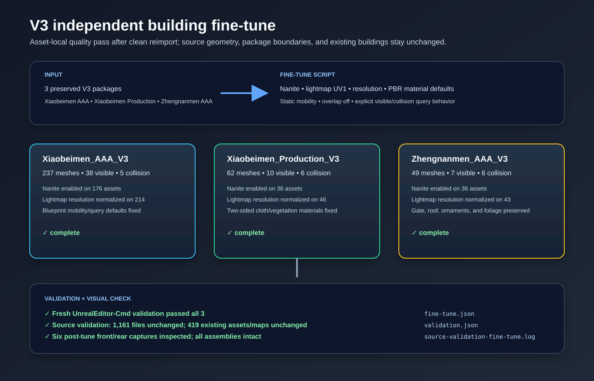

# V3 building fine-tune

The three imported V3 building Blueprints were rebuilt from their preserved source packages after a disk-full write interrupted an earlier editor-side pass. The fine-tune then enabled Nanite for render meshes, normalized lightmap UV/resolution settings, set stable opaque/two-sided PBR defaults, and made visible versus collision component query/shadow behavior explicit. Source geometry, transforms, package-local dependencies, and existing buildings were preserved.

Validation passed in a fresh UnrealEditor-Cmd process for all three Blueprints. Source validation reported 1,161 source files unchanged, 234 PNGs valid, one documented regenerated ORM texture, and 419 existing assets/maps unchanged. Six post-tune front/rear captures were inspected for intact assemblies.

Post-tune captures: [Xiaobeimen AAA front](../../../Saved/RawModelImport/V3/Xiaobeimen_AAA_V3-front.png), [Xiaobeimen AAA rear](../../../Saved/RawModelImport/V3/Xiaobeimen_AAA_V3-rear.png), [Xiaobeimen Production front](../../../Saved/RawModelImport/V3/Xiaobeimen_Production_V3-front.png), [Xiaobeimen Production rear](../../../Saved/RawModelImport/V3/Xiaobeimen_Production_V3-rear.png), [Zhengnanmen AAA front](../../../Saved/RawModelImport/V3/Zhengnanmen_AAA_V3-front.png), and [Zhengnanmen AAA rear](../../../Saved/RawModelImport/V3/Zhengnanmen_AAA_V3-rear.png).
