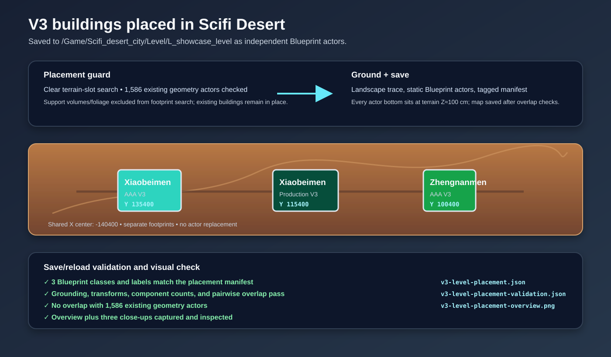

# V3 building placement

The three fine-tuned V3 Blueprint actors are now placed in `/Game/Scifi_desert_city/Level/L_showcase_level` on separate clear terrain slots at the outer landmark row. They are tagged `ImportedGuangzhouLandmarkV3`, grounded to the Landscape, and saved in the level without replacing existing Buildings.

The placement search checked 1,586 existing geometry actors. Save/reload validation confirms the Blueprint classes, labels, transforms, component counts, terrain contact, pairwise separation, and no overlap with existing geometry. The overview and three close-ups were visually inspected.

Evidence: [placement manifest](../../../Saved/RawModelImport/V3/v3-level-placement.json), [reload validation](../../../Saved/RawModelImport/V3/v3-level-placement-validation.json), [overview capture](../../../Saved/RawModelImport/V3/v3-level-placement-overview.png), [Xiaobeimen AAA close-up](../../../Saved/RawModelImport/V3/v3-level-placement-Xiaobeimen_AAA_V3.png), [Xiaobeimen Production close-up](../../../Saved/RawModelImport/V3/v3-level-placement-Xiaobeimen_Production_V3.png), and [Zhengnanmen AAA close-up](../../../Saved/RawModelImport/V3/v3-level-placement-Zhengnanmen_AAA_V3.png).
