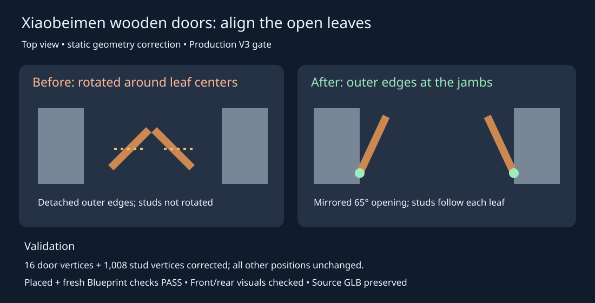

# Xiaobeimen wooden door alignment

Correct the selected Production V3 gate's wooden inner doors. The supplied geometry rotated each leaf around its center, leaving outer edges away from the jambs, while the metal studs retained their unrotated layout.

Two derived mesh assets now place the outer edges at x = +/- 240 cm, depth 370 cm, with mirrored 65 degree open angles. Studs follow the same leaf transform. The Blueprint and showcase instance reference these meshes. This is a static pose correction; no animated door system was introduced. Original source and imported mesh assets remain intact.

Validation: geometry assertions passed for 16 wood vertices and 1,008 stud vertices; all other vertex positions unchanged. Editor assertions passed for the placed and newly spawned Blueprint (16 components, two corrected mesh references). Front, rear oblique, and centered rear screenshots were visually inspected. Independent review was not performed; local evidence was packaged using the current handoff skill.

Evidence: `Saved/GateDoorFix/geometry-validation.json`, `editor-validation.json`, `asset-changes.json`; screenshots `Saved/gate-door-before.png`, `Saved/gate-door-after.png`, `Saved/gate-door-rear-after.png`, `Saved/gate-door-rear-centered.png`. Blueprint and pre-save map backups are in `Saved/GateDoorFix/`.

