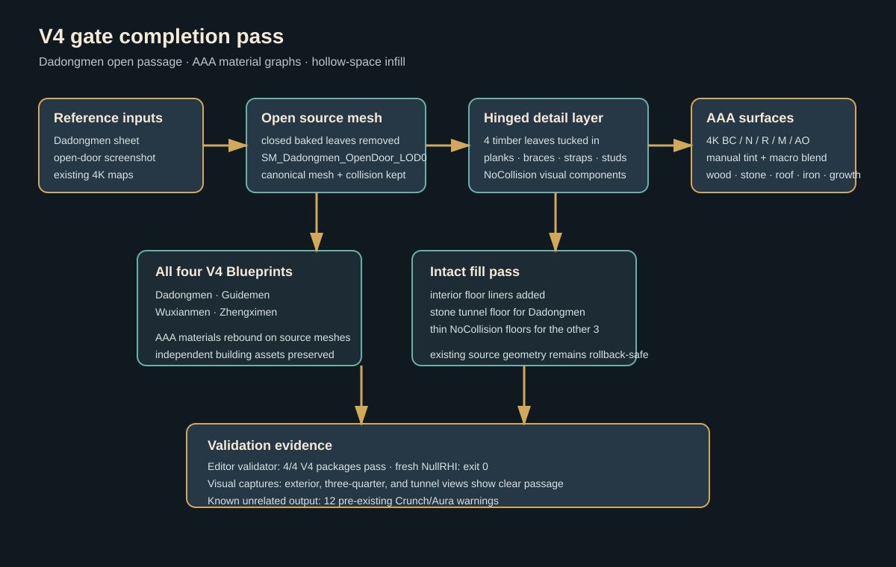

# Dadongmen open door, AAA materials, and V4 hollow-space infill

The follow-up pass responds to the supplied Dadongmen reference and tunnel screenshot. The combined Dadongmen source mesh now uses an open-door variant with its baked closed leaves removed. Four paired timber leaves are authored as independent Blueprint components on the tunnel jamb hinges, with rotated planks, braces, iron straps, and studs. The tunnel floor is lined with a continuous stone component so the passage does not expose the former hollow base.

All four V4 building Blueprints received manually rebuilt sibling `_AAA` materials. The graphs reuse the package 4K maps for base color, normal, roughness, metallic, and AO, add a restrained same-map macro blend, and use reference-driven surface tints. Dadongmen also has dedicated door-wood, dark-metal, and vegetation graphs; the latter keeps facade growth green and low-specular under the preview light. Guidemen, Wuxianmen, and Zhengximen receive thin stone floor liners using their existing cube resource and AAA stone materials.

The original Dadongmen source mesh and collision path remain available for rollback. Door and infill components use `NoCollision`; gameplay collision remains on the imported source asset. The saved preview map is `/Game/Assets/Environment/GuangzhouLandmarks/V4/Dadongmen/L_Dadongmen_V4_Preview`.

Validation completed:

- `ValidateV4Buildings.py` passed Dadongmen, Guidemen, Wuxianmen, and Zhengximen in the editor and in a fresh `UnrealEditor-Cmd.exe -NullRHI` process (exit 0).
- The fresh report contains 61 Dadongmen components, 21 Guidemen components, 10 Wuxianmen components, and 3 Zhengximen components, with all package checks passing. Wuxianmen and Zhengximen each include one existing `DeepAAA_DetailGeometry` visual component in addition to the new floor liner.
- Native SceneCapture checks were inspected for the exterior, three-quarter, and tunnel views. The tunnel view shows a clear center passage, side-tucked timber leaves, detailed stone arch walls, and a continuous floor.

Visual evidence:

- [front scene capture](../../../Saved/RawModelImport/V4/Dadongmen_V4-scene-y.png)
- [three-quarter scene capture](../../../Saved/RawModelImport/V4/Dadongmen_V4-scene-hero.png)
- [tunnel scene capture](../../../Saved/RawModelImport/V4/Dadongmen_V4-door-scene.png)
- [implementation validation packet](C:/Users/mickie/.codex/visualizations/2026/09/15/dadongmen-open-door-aaa-materials/implementation-validation-packet.md)

