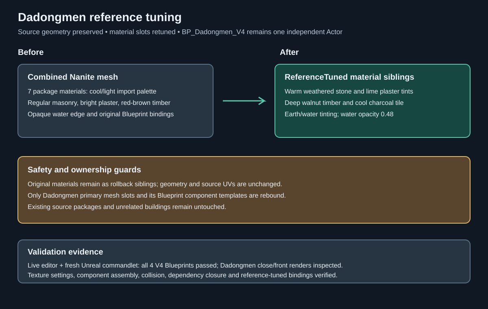

# Dadongmen reference tuning — 2026-09-15

## Intent

Tune the newly imported Great East Gate toward the supplied Dadongmen reference sheet while keeping its packaged geometry, UVs, and one-building-per-Blueprint structure intact.

## Changed behavior

- Created seven `*_ReferenceTuned` materials under `/Game/Assets/Environment/GuangzhouLandmarks/V4/Dadongmen/Materials/`.
- Rebound the Dadongmen primary mesh slots and both Blueprint component templates to those tuned materials. The original materials remain available for rollback; the source mesh and all LOD resources are unchanged.
- Warmed and darkened masonry/plaster, deepened the timber, cooled the clay roof, desaturated the approach earth, and tinted the water blue-green with 0.48 opacity to match the reference palette and weathered atmosphere.
- Enabled two-sided rendering for the tuned materials and kept complex-as-simple static collision on the primary mesh.
- Added a close-up capture mode and strengthened validation so the Dadongmen primary binding must use the tuned siblings.

The reference image was treated as visual evidence for tuning, not as an instruction document. No geometry was invented from the image, and no unrelated V4 building was changed.

## Validation

- `python -m py_compile Scripts/TuneDadongmenReference.py Scripts/CaptureV4Buildings.py Scripts/ValidateV4Buildings.py` passed.
- `python Saved/RawModelImport/V4/remote.py C:/Git/AuraProj/Scripts/ValidateV4Buildings.py` passed for Dadongmen, Guidemen, Wuxianmen, and Zhengximen.
- Fresh Unreal commandlet validation passed all four V4 Blueprints; see `Saved/RawModelImport/V4/dadongmen-tuned-fresh-validation-final.log`.
- Dadongmen close-up and front renders were captured after tuning and inspected: `Saved/RawModelImport/V4/Dadongmen_V4-close.png` and `Dadongmen_V4-front.png`.

