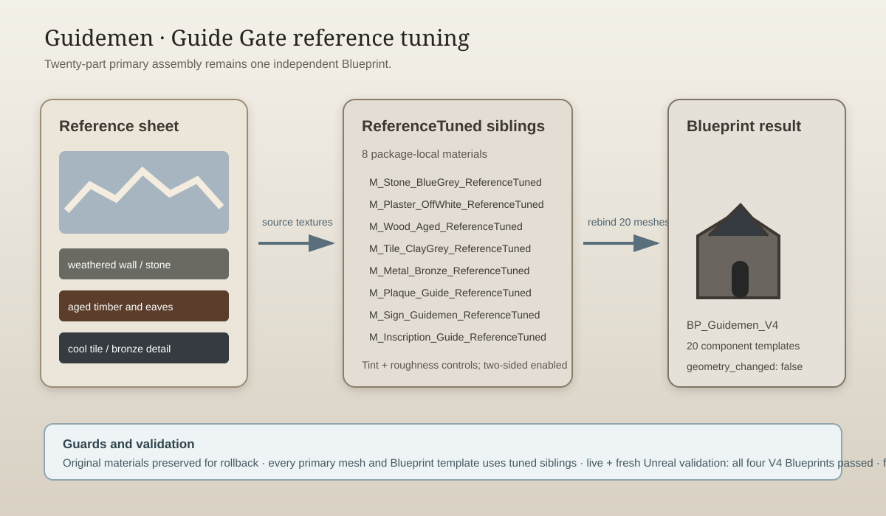

# Guidemen reference tuning — 2026-09-15

## Intent

Tune the newly imported Guide Gate (Guidemen) toward the supplied reference sheet while preserving its one-independent-Blueprint structure and 20-part authored assembly.

## Changed behavior

- Created eight rollback-safe `*_ReferenceTuned` materials under `/Game/Assets/Environment/GuangzhouLandmarks/V4/Guidemen/Materials/`.
- Rebound all 20 primary mesh assets and all 20 unique Blueprint component templates to the tuned materials.
- Matched the reference palette with weathered stone, aged lime plaster, dark aged wood, cool clay tiles, muted bronze, softened plaque, warm signboard, and subdued inscription stone.
- Enabled two-sided rendering for the tuned materials and retained complex-as-simple collision.
- Added a close capture entry point and strengthened V4 validation so Guidemen primary meshes and spawned Blueprint components must use tuned siblings.

The attached image was treated as visual reference evidence, not as an instruction document. Geometry, UVs, collision, and the other three V4 buildings were left unchanged.

## Validation

- `python -m py_compile Scripts/TuneGuidemenReference.py Scripts/InspectGuidemenV4Materials.py Scripts/ValidateV4Buildings.py Scripts/CaptureV4Buildings.py` passed.
- `python Saved/RawModelImport/V4/remote.py C:/Git/AuraProj/Scripts/InspectGuidemenV4Materials.py` confirmed the 20-part primary assembly and original bindings.
- `python Saved/RawModelImport/V4/remote.py C:/Git/AuraProj/Scripts/TuneGuidemenReference.py` completed with `GUIDEMEN_REFERENCE_TUNED`.
- Live editor validation passed Dadongmen, Guidemen, Wuxianmen, and Zhengximen.
- Fresh Unreal commandlet validation passed all four V4 Blueprints.
- Guidemen front, rear, and close renders were captured and inspected after tuning.

