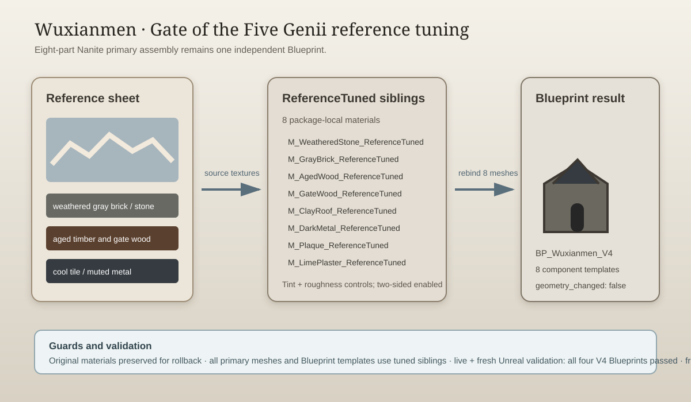

# Wuxianmen reference tuning — 2026-09-15

## Intent

Tune the newly imported Wuxianmen (Gate of the Five Genii) toward the supplied reference sheet while keeping its eight-part Nanite primary assembly inside one independent Blueprint.

## Changed behavior

- Created eight rollback-safe `*_ReferenceTuned` materials under `/Game/Assets/Environment/GuangzhouLandmarks/V4/Wuxianmen/Materials/`.
- Rebound all eight primary Nanite mesh assets and all eight unique Blueprint component templates to the tuned materials.
- Matched the reference palette with weathered gray masonry, aged timber, darker gate wood, cool clay tiles, muted dark metal, softened plaque, and restrained lime plaster.
- Enabled two-sided rendering for the tuned materials and retained complex-as-simple collision.
- Added a close capture entry point and strengthened V4 validation so Wuxianmen primary meshes and spawned Blueprint components must use tuned siblings.

The attached image was treated as visual reference evidence, not as an instruction document. Geometry, UVs, collision, and the other three V4 buildings were left unchanged.

## Validation

- `python -m py_compile Scripts/TuneWuxianmenReference.py Scripts/InspectWuxianmenV4Materials.py Scripts/ValidateV4Buildings.py Scripts/CaptureV4Buildings.py` passed.
- `python Saved/RawModelImport/V4/remote.py C:/Git/AuraProj/Scripts/InspectWuxianmenV4Materials.py` confirmed the eight-part primary assembly and Blueprint template scope.
- `python Saved/RawModelImport/V4/remote.py C:/Git/AuraProj/Scripts/TuneWuxianmenReference.py` completed with `WUXIANMEN_REFERENCE_TUNED`.
- Live editor validation passed Dadongmen, Guidemen, Wuxianmen, and Zhengximen.
- Fresh Unreal commandlet validation passed all four V4 Blueprints.
- Wuxianmen front, rear, and close renders were captured and inspected after tuning.

