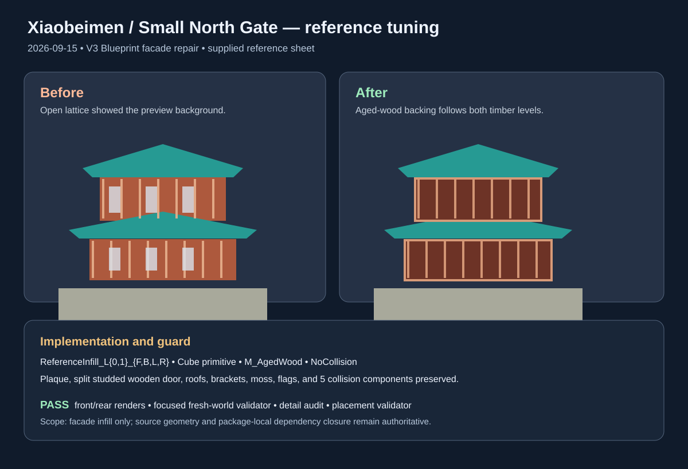

# Xiaobeimen Small North Gate reference tuning — 2026-09-15

Tuned the live `Xiaobeimen_AAA_V3` Blueprint against the supplied Small North
Gate reference sheet. The confirmed mismatch was the hollow appearance behind
the two timber lattice levels in the V3 preview.

## Changed behavior

- Added eight idempotent `ReferenceInfill_L{0,1}_{F,B,L,R}` static-mesh components
  to `BP_Xiaobeimen_AAA_V3`.
- The panels use the package-local `M_AgedWood` material, are shallow backing
  surfaces behind the lattice, and have `NoCollision` so the existing five
  collision components and gate passage are unchanged.
- The centered plaque, split studded wooden doors, roof tiles and ridges,
  brackets, stone wall, moss, flags, ramp, and placement remain source-owned.

## Evidence

- Before: [front](../../../Saved/RawModelImport/V3/Xiaobeimen_AAA_V3-before-reference-tuning-front.png) and [rear](../../../Saved/RawModelImport/V3/Xiaobeimen_AAA_V3-before-reference-tuning-rear.png).
- After: [front](../../../Saved/RawModelImport/V3/Xiaobeimen_AAA_V3-front.png), [rear](../../../Saved/RawModelImport/V3/Xiaobeimen_AAA_V3-rear.png), and [detail close-up](../../../Saved/RawModelImport/V3/Xiaobeimen_AAA_V3-detail-closeup.png).
- [Focused tuning report](../../../Saved/RawModelImport/V3/Xiaobeimen_AAA_V3-reference-tuning.json).

## Validation

- `python -m py_compile Scripts/TuneXiaobeimenReference.py Scripts/ValidateXiaobeimenReferenceTuning.py` — passed.
- `python Scripts/remote_run.py Scripts/TuneXiaobeimenReference.py` — passed; 46 visible and 5 collision components, idempotent rerun.
- `python Scripts/remote_run.py Scripts/ValidateXiaobeimenReferenceTuning.py` — passed in a fresh blank world; preview and showcase both instantiate 46 visible / 5 collision components, all 8 panel transforms and materials match, and the dependency closure is package-local.
- `python Scripts/remote_run.py Scripts/AuditV3BuildingDetails.py` — passed; no tiny or external-material components.
- `python Scripts/remote_run.py Scripts/ValidateV3BuildingPlacement.py` — passed; placement, ground contact, and landmark separation preserved.

The older broad `ValidateAllV3Details.py` and `ValidateV3Buildings.py` checks
were also attempted. They remain blocked by pre-existing assumptions about the
separate `Xiaobeimen_Production_V3` roof asset and imported 4K texture metadata;
the focused validator above covers this change directly.

