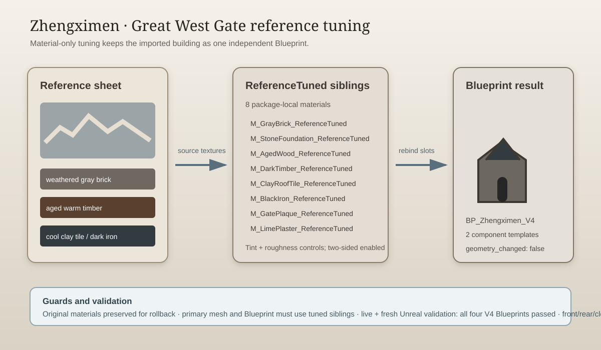

# Zhengximen reference tuning — 2026-09-15

## Intent

Tune the newly imported Great West Gate (Zhengximen) toward the supplied reference sheet while preserving its one-independent-Blueprint structure and authored geometry.

## Changed behavior

- Created eight rollback-safe `*_ReferenceTuned` materials under `/Game/Assets/Environment/GuangzhouLandmarks/V4/Zhengximen/Materials/`.
- Rebound the Zhengximen primary mesh slots and both Blueprint static-mesh component templates to the tuned materials.
- Matched the reference palette with weathered gray brick, warmer foundation stone, aged wood, dark timber, cool clay tiles, muted iron, softened plaque, and restrained plaster.
- Enabled two-sided rendering for the tuned materials and retained complex-as-simple collision.
- Added a close capture entry point and strengthened V4 validation so both tuned gates must use tuned primary materials.

The attached image was treated as visual reference evidence, not as an instruction document. Geometry, UVs, collision, and the other three V4 buildings were left unchanged.

## Validation

- `python -m py_compile Scripts/TuneZhengximenReference.py Scripts/InspectZhengximenV4Materials.py Scripts/ValidateV4Buildings.py Scripts/CaptureV4Buildings.py` passed.
- `python Saved/RawModelImport/V4/remote.py C:/Git/AuraProj/Scripts/TuneZhengximenReference.py` completed with `ZHENGXIMEN_REFERENCE_TUNED`.
- Live editor validation passed Dadongmen, Guidemen, Wuxianmen, and Zhengximen.
- Fresh Unreal commandlet validation passed all four V4 Blueprints.
- Zhengximen front, rear, and close renders were captured and inspected after tuning.

