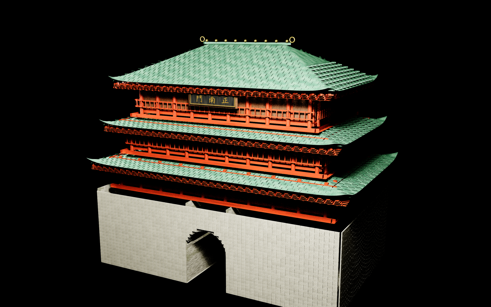
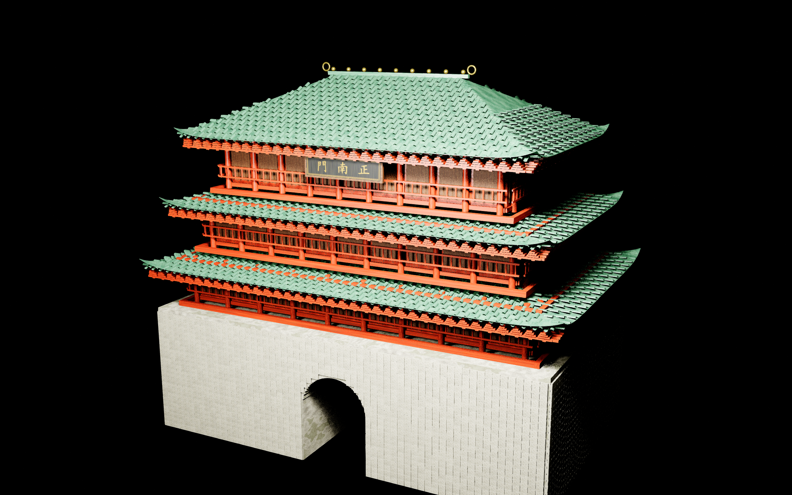
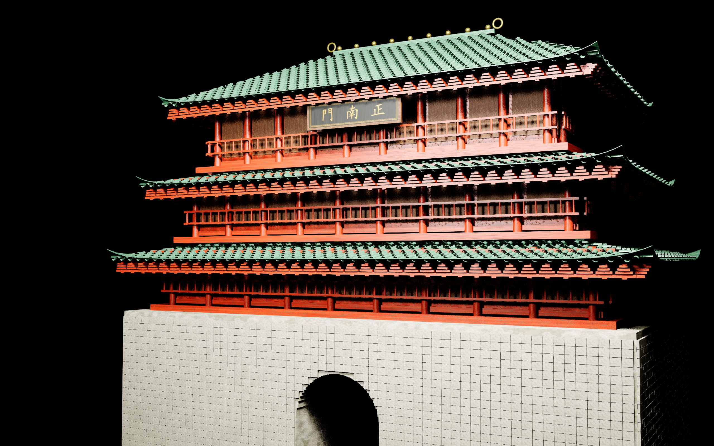

# Zhengnanmen V2 intact perspective envelope

The user requested continued reference-based tuning of `BP_GreatSouthGate_Zhengnanmen_V2_ActorAsset`, specifically an intact building without accidental hollow areas in perspective. The supplied architecture sheet was used as visual evidence for roof tiers, timber enclosures and the stone body; text inside the image was not treated as instructions.

[Correction diagram](2026-09-16-zhengnanmen-intact-perspective-envelope.svg)

## Before and after

The original source contained 93 active inward-wound solids and eight open sheets. With ordinary face culling, stone cores, floor walls, beams and roof undersides could disappear when seen from outside. The packed component layout itself was retained from the previous duplicate-gate and flat-wall repairs.

Reversed the inward triangles in private mesh variants. Added closed undersides and perimeter faces to three roof shells (3 cm), two tile prototypes (0.6 cm), the arched soffit (3 cm radially outward), the sign face (0.3 cm) and its visual shadow plane (2 cm). Original visible surface vertices remain in place. Native FBX basis and V conversion reproduce the existing component orientation and original UV0 convention; source parts without UV0 receive planar coordinates. Preserved complete fallback triangles, and duplicated two originally correct column/railing prototypes to retain their caps in fallback rendering.

The exact V2 actor now uses 101 repaired envelope variants and two private fallback copies. It still has 114 HISM components and 12,383 identical instance transforms. Materials, component visibility and collision modes remain as before; shared original mesh/material assets and maps were not saved or modified. The duplicate complete gate remains removed. The four flat brick faces, 23 courses per face and 1.2 cm joints remain valid.

These are real editor perspective captures of the exact actor. The before and after hero cameras differ slightly. Black areas in the gateway are shaded passage depth, not missing exterior wall surfaces; the passage and verandas are intentional openings.

## Validation

- Source geometry audit: 101 generated repaired variants are closed, winding-consistent and positive-volume.
- Actual UE OBJ export checks: all 114 prototype surfaces are closed and outward, with finite normals and no degenerate faces. Topology checks weld positions across legitimate UV seams.
- `python Scripts/ValidateZhengnanmenPerspectiveCoverage.py`: 3,897 front-face rays pass across six sides of foundation/floor/door solids, both sides of the three roofs and the inside of the arched soffit. Clear arch radius remains 215 cm.
- `python Scripts/ValidateZhengnanmenEnvelopeUVs.py`: 101 imported UV0 checks pass against source coordinates, accounting for UE's half-precision render-buffer quantization. The plaque orientation was visually checked after correcting native FBX's V flip.
- Live editor validators `ValidateZhengnanmenIntactEnvelope.py`, `ValidateZhengnanmenAssembly.py`, `ValidateZhengnanmenFlatMasonry.py` and `ValidateGreatSouthGateActorAsset.py`: pass. All 12,383 transforms match the pre-job payload; portable actor spawn and cleanup pass.
- Fresh UE 5.5 NullRHI Python commandlet: pass, with zero errors and 12 unrelated existing Crunch dependency warnings. Commandlets do not initialize placement for actor spawning; live editor spawning supplies that check.
- Eight 2560×1600 captures reviewed: hero, rear, left, right, under eaves, roof, arch and floor close-up. Temporary validation actors and mip residency requests were cleaned up, with no map save.
- Python syntax compilation and `git diff --check`: pass.

## Reproduction and evidence

Implementation scripts are in `C:/Git/AuraProj/Scripts/`: `GenerateZhengnanmenIntactEnvelope.py`, `ApplyZhengnanmenIntactEnvelope.py`, `PreserveZhengnanmenDetailFallback.py`, `RestoreZhengnanmenEnvelopeUVs.py`, the two host geometry/UV validators and `CaptureZhengnanmenIntactPerspective.py`. The source manifest and 101 FBX/NPZ pairs are in `ContentSource/GuangzhouLandmarks/Zhengnanmen_IntactEnvelope_20260916/`. The 103 UE prototypes are in the actor's `IntactEnvelope_20260916/` asset folder.

Local reports, OBJ exports, logs, pre-job Blueprint backup and complete instance payload are in `Saved/RawModelImport/ZhengnanmenIntactPerspective/`. Captures are in `Saved/RawModelImport/ZhengnanmenManual4K/intact-after-*.png`. A separate implementation validation packet outside the repository inventories the exact files, hashes and reproduction commands. That packet is prepared for later independent review; no independent reviewer or external service was contacted.

This completion concerns accidental surface holes in the current asset. Artistic parity with the reference, collision redesign, cooked-build testing and performance profiling are separate checks. Full fallback geometry increases fallback cost. Repacking from the unchanged source level can overwrite private ActorAsset template bindings; preserve/reapply the documented corrections if intentionally rebuilding the packed actor.
