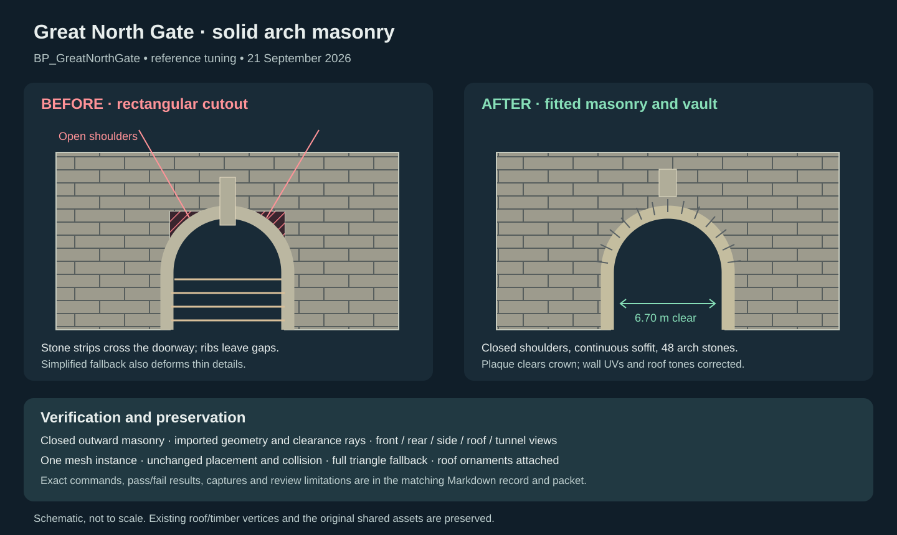
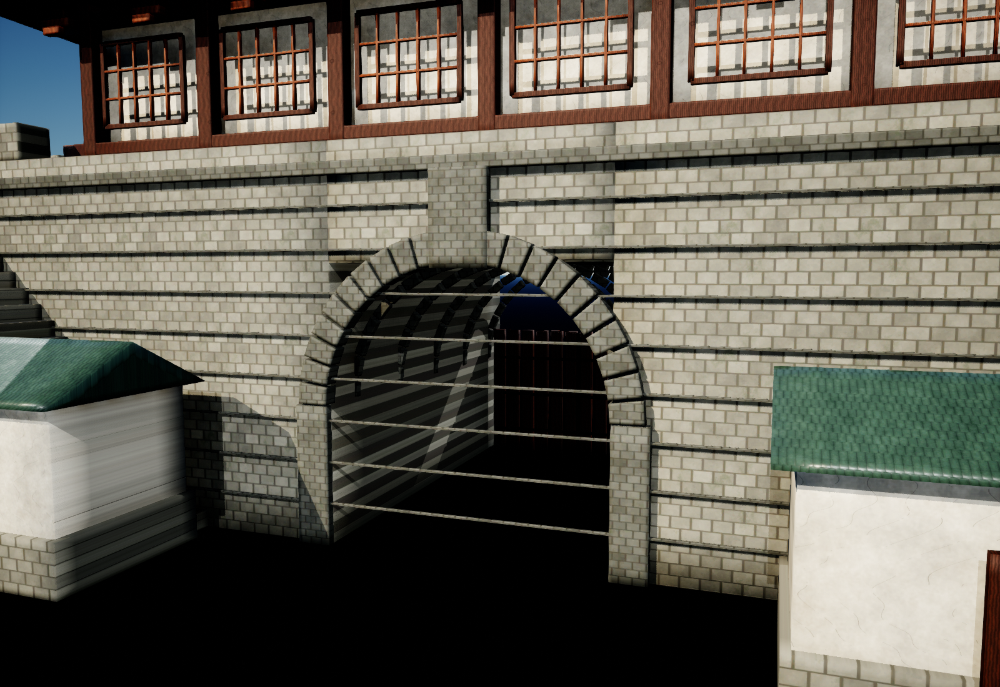
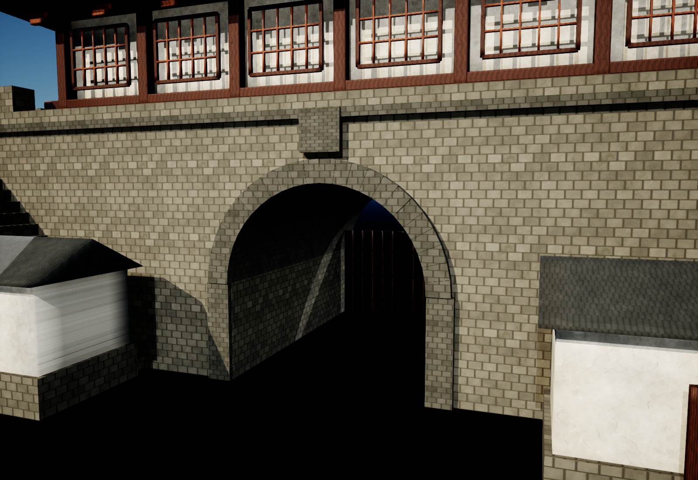
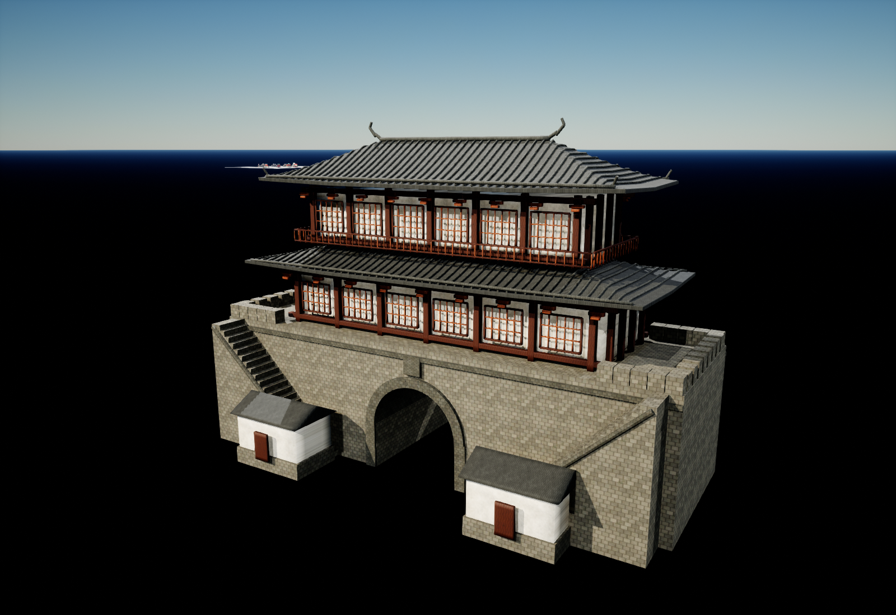

# Great North Gate: arch masonry and reference tuning

Date: 2026-09-21. Target: `/Game/Assets/Environment/GuangzhouLandmarks/GreatNorthGate/BP_GreatNorthGate`.

## Intent and result

Repair the open upper shoulders around the arch, stray geometry, and material mismatches identified against the user's reference. The reference image was used as visual evidence; its printed captions were not treated as instructions.

The wall previously had a rectangular opening around disconnected arch ribs. Eight thin stone string courses crossed the passage. The central stone plaque overlapped the arch crown, masonry side faces had collapsed UVs that rendered as stripes, the two ridge ornaments floated above their mounts, and the roof was green.

The Blueprint now uses a private mesh with closed shoulder masonry, a continuous vault, and 24 fitted arch stones at each end. The 6.70 m entrance width and 3.35 m clear radius are preserved. The crossing strips were removed, the plaque now spans Z 7.65–9.00 m above the 7.45 m outer arch crown, and 48,140 collapsed masonry UV triangles were repaired. Two small closed mounts connect the existing ridge ornaments; original roof and timber vertices remain intact. Four private material variants give the masonry a warmer muted stone tone and the roof a darker gray clay appearance.



| Before, identical inspection lighting | After |
| --- | --- |
|  |  |



## Saved assets and preserved state

- Modified: `Content/Assets/Environment/GuangzhouLandmarks/GreatNorthGate/BP_GreatNorthGate.uasset`.
- Added under `GreatNorthGate/ArchRepair20260921/`: `SM_GreatNorthGate_ArchRepairFinal.uasset`, `M_Stone_Reference.uasset`, `M_StoneDark_Reference.uasset`, `M_RoofTile_Reference.uasset`, and `M_RoofRidge_Reference.uasset`.
- The Blueprint retains its root plus one HISM component, one identity instance, component transforms, visibility, mobility, and collision intent. Original shared assets are unchanged. Prototype bounds remain exactly the original bounds to the asserted 0.001 cm tolerance.
- Nanite remains enabled, with explicit 100% triangle fallback and zero fallback error. LOD0 contains 13,280,040 triangles, preserving the dense source details instead of exporting the old reduced mesh as a replacement.
- The existing showcase placement had a serialized old mesh override. That single instance was refreshed in memory without changing its transform or instance payload. **No map was saved. The open showcase level remains dirty; save it normally to persist that instance override.** The Blueprint and its five private assets are saved independently.

## Validation

All results below were collected locally by the implementing agent.

| Check | Result |
| --- | --- |
| Asymmetric import probe | PASS: source `(x,y,z)` metres becomes UE `(100x,-100y,100z)` cm; OBJ exporter writes `(UE x, UE z, UE y)` |
| Actual UE LOD0 section readback | PASS: all 8 sections, 13,280,040 triangles; no nonfinite positions/normals/UVs, no degenerate triangles, no normals opposed to winding |
| Masonry topology after import | PASS: 86 Stone and 58 StoneDark solids; zero open or inward parts |
| Shoulder coverage from both façades | PASS: 360/360 outward-facing hits |
| Continuous soffit | PASS: 793/793 inward-viewable hits; minimum clear radius 3.349999942 m within float precision |
| Clear front entrance below springline | PASS: 1,089 rays; zero unintended masonry obstructions |
| UV round trip | PASS: largest corner error 0.00390625, within UE half-precision UV tolerance; position error below 0.000001 m |
| Ridge mounts | PASS: all four mount endpoints overlap original roof/ornament surfaces within their 0.12 m radius |
| Live fresh Blueprint spawn | PASS: one mesh component, one instance, final mesh and all eight material assignments, unchanged collision mode |
| Fresh UnrealEditor-Cmd / NullRHI process | PASS: saved component and material snapshots match; full fallback settings persist; exit 0 |
| Visual completion check | PASS: hero, front, rear, both sides, low/under-eave, roof/top, arch, wall, and lit tunnel ceiling reviewed |
| Preview cleanup | PASS: task actors removed, render target released, resident mip requests released, no map save |
| Script syntax and Git whitespace | PASS |

## Evidence and reproduction

The self-contained local evidence directory is:

`C:/Users/mickie/.codex/visualizations/2026/09/21/01a0c153-14c3-7853-b744-4b08d4fd6246/northgate/`

It contains the immutable Blueprint backup and component baseline, supplied reference, generated source GLB, import records, per-section binary render readbacks and hashes, source/geometry/UV/ray reports, before/after captures, final live cleanup and showcase refresh reports, fresh-process logs, complete scripts, and `implementation-validation-packet.md` with inventories and exact commands.

Key commands, from `C:/Git/AuraProj` (replace `$R` with the evidence directory):

```powershell
python "$R/validate_source.py"
python Scripts/remote_run.py "$R/export_sections.py"
python "$R/validate_geometry.py"
& C:/Git/UnrealEngine-5.5/Engine/Binaries/Win64/UnrealEditor-Cmd.exe C:/Git/AuraProj/Aura.uproject -run=pythonscript -script="$R/fresh_validate.py" -nullrhi -unattended -nosplash -nosound -nop4
git diff --check
```

Import and apply scripts are guarded mutations, not repeatable read-only tests. Use the packet's source mapping and the baseline backup for rollback. Do not rerun capture scripts after cleanup without establishing a new task-owned transient stage.

## Limits and review status

No independent review was performed. The current `in-app-claude-handoff` skill prepares a local packet and explicitly does not contact an external reviewer. Nothing was uploaded.

The fresh commandlet emitted existing project dependency warnings involving Crunch and metadata; it ended with zero errors. Unreal also warned about degenerate tangent bases in the dense source-derived mesh. Render normals and triangle checks passed, and inspected materials render correctly; a cooked-build performance/collision test and exhaustive UV reauthoring of unchanged roof/timber/plaster surfaces were not performed. Architectural solids overlap at construction joints; this asset is not represented as one Boolean manifold.

The optional browser preview of the local SVG was blocked by browser URL policy. Its XML was validated locally; the actual Blueprint's visual check used Unreal render captures, independently of that optional diagram preview.
