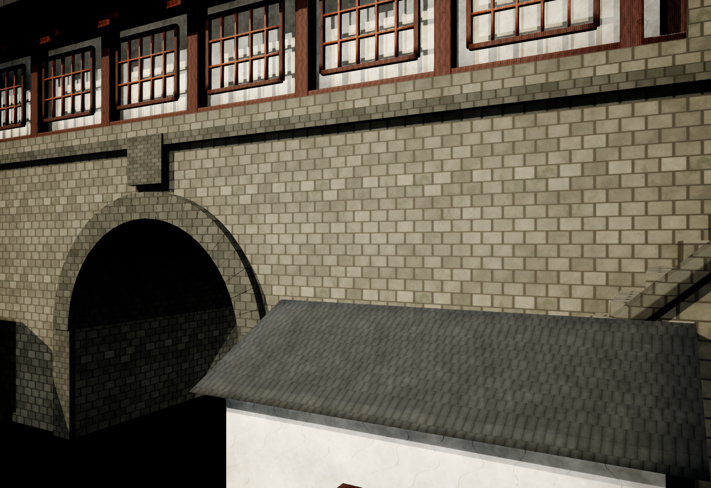
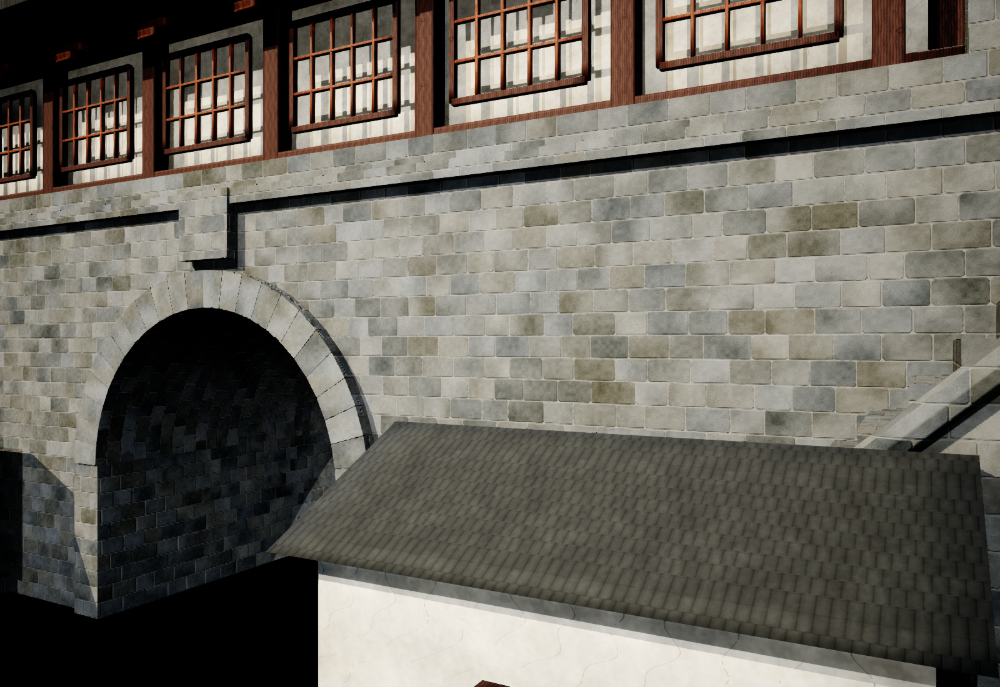

# Great North Gate wall brick tuning

Date: 2026-09-21. Follow-up to the arch repair, requested because the wall bricks still looked abnormal.

The prior wall used a uniform small brick grid with broad dark mortar, and the same grid crossed the modeled arch stones. Two private procedural materials now use local centimetres rather than the mesh's fragmented UV mapping: level 34 cm courses, nominal 56 cm stone widths varying from 40.32 to 71.68 cm, nominal 1.3 cm joints, chipped corners, mineral variation and rough normal relief. The reference's gray stone masonry informed the appearance. Arch wedges render as single stones and the vault uses cylindrical mapping.

| Before | After |
| --- | --- |
|  |  |

## Changes and preservation

- Saved `Content/Assets/Environment/GuangzhouLandmarks/GreatNorthGate/BP_GreatNorthGate.uasset`: changed only override material slots 6 and 7.
- Added `WallBricks20260921/M_Wall_HewnStone.uasset` and `WallBricks20260921/M_Arch_HewnStone.uasset` beneath that same GreatNorthGate folder.
- Mesh SHA-256 remains `d61f09b98000079c77f1691c481a7260bd06b2d0585d3ebf29f01722af8e2e39`; 13,280,040 triangles, no added vertices, no displacement, unchanged bounds and clear arch. Prior imported geometry/ray evidence remains applicable by exact asset hash, rather than being represented as rerun.
- Root, one HISM, one identity instance, transforms, visibility, collision, six other material overrides and shared originals are unchanged.
- Existing showcase instance received those two materials in memory. The map was already dirty at baseline and was not saved. Save the open level normally to persist its overrides.

## Validation

PASS: compiled material graphs and exact saved HLSL readback; preview and fresh actor spawn; Blueprint payload comparison; separate UnrealEditor-Cmd NullRHI serialization (exit 0, zero errors, 12 existing project dependency/metadata warnings); hero/front/rear/both sides/low/top/arch/wall/lit tunnel inspection; 37 degree rotated actor mapping check; removal of all transient preview actors and release of render target/mip residency; script syntax and Git whitespace.

The material statistics report 467 and 487 pixel shader instructions respectively on this editor platform. Cooked-platform performance was not profiled. Relief is shading, not individually displaced stones. Existing roof/timber/plaster geometry and texturing were preserved. No independent review was performed; the current handoff skill prepares a local review packet without external contact.

## Evidence

`C:/Users/mickie/.codex/visualizations/2026/09/21/01a0c153-14c3-7853-b744-4b08d4fd6246/northgate-wall-bricks/implementation-validation-packet.md` provides complete changed-file/artifact hashes, immutable Blueprint baseline, material source HLSL, graph construction/application/capture/check scripts, exact commands, reports and before/after captures. `git-before.txt` separates the preceding arch job from this revision. Earlier archive entries remain immutable.
