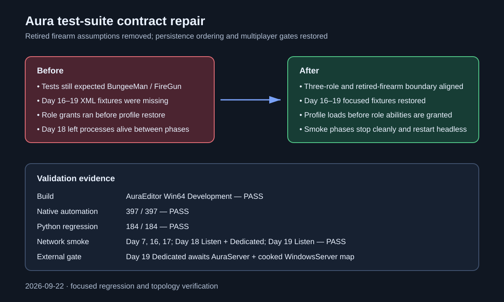

# Test-suite contract repair

## Intent

Repair the build and regression suite after the playable-role contract moved to Aura, Crunch, and Civilian and retired BungeeMan/FireGun assumptions remained in tests and runtime probes.

## Changed behavior

- Updated native and Python contracts to validate the retired role/firearm boundary instead of requiring removed definitions.
- Restored the Day 16–19 XML automation fixtures and refreshed gameplay-expansion integrity metadata.
- Applied persistent profile data before role-at-spawn grants, preventing restored state from being overwritten.
- Made the landmark panel local-player-only for headless automation.
- Bounded Day 18 process lifetime between phases and used a headless authority restart so profile restoration is deterministic.
- Updated the Day 19 server fixture to require the retired FireGun configuration to be absent.

## Validation

- AuraEditor Win64 Development build: passed.
- Native `Aura` automation namespace: 397/397 passed.
- Python regression suite: 184/184 passed.
- Day 7 Listen and Dedicated smoke: passed.
- Day 16 and Day 17 Listen and Dedicated smoke: passed.
- Day 18 persistence Listen and Dedicated smoke: passed.
- Day 19 Listen smoke: passed, including its Day 18 reconnect prerequisite and bounded performance samples.
- Day 19 Dedicated remains an environment prerequisite: this installed engine has no built `AuraServer.exe` or cooked WindowsServer StartupMap.

