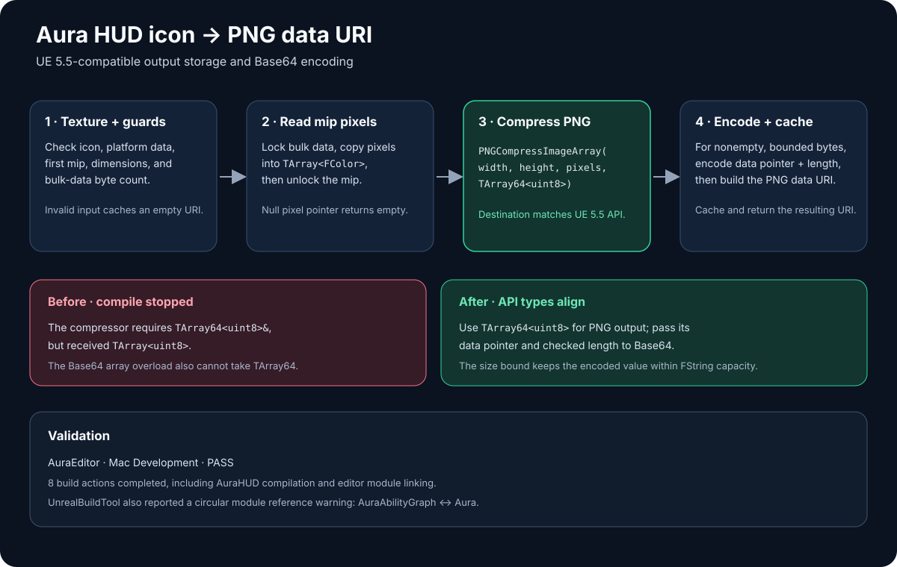

# Aura HUD PNG buffer fix

## Intent

Fix the AuraEditor Mac build failure in `AAuraHUD::BuildAbilityIconDataUri` while keeping the WebUI icon PNG-to-data-URI flow intact.

## Changed behavior

- PNG compression now receives a `TArray64<uint8>`, matching UE 5.5's `PNGCompressImageArray` destination type.
- Base64 conversion uses the byte pointer and length overload because `FBase64::Encode` does not accept `TArray64<uint8>` directly.
- Conversion runs only for nonempty PNG data whose length stays within a safe `FString` output bound. Existing icon, mip, dimensions, and bulk-data checks remain in place.

## Validation

- `UE_ENGINE_ROOT=/Volumes/M2/Engine/UE_5.5 ./BuildEditor.command` — passed for AuraEditor Mac Development (8 build actions).
- UnrealBuildTool reported a circular module reference warning between `AuraAbilityGraph` and `Aura` during the successful build.

