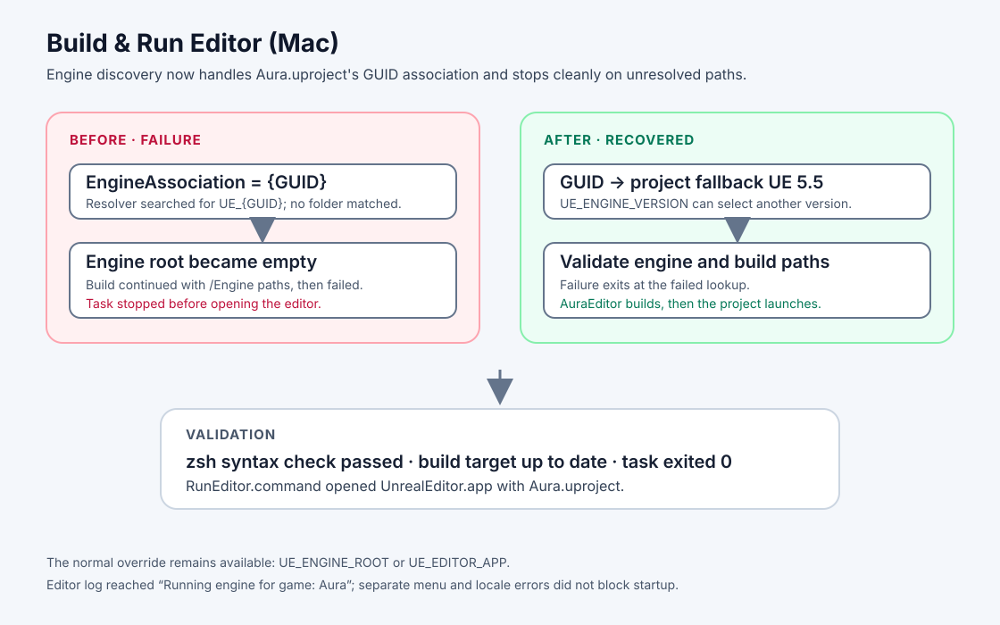

# macOS editor task GUID engine resolution

## Intent

Make the VS Code “Build & Run Editor (Mac)” task resolve the project's mounted Unreal Engine installation when `Aura.uproject` stores an EngineAssociation GUID.

## Changed behavior

- Mounted-engine discovery now uses AuraProj's documented UE 5.5 version when the association is a GUID. Set `UE_ENGINE_VERSION` to select a different version, or use the existing `UE_ENGINE_ROOT` / `UE_EDITOR_APP` overrides.
- `BuildEditor.command` and `RunEditor.command` now stop immediately when association, engine-root, build-script, or editor-app resolution fails. This prevents later commands from operating on an empty `/Engine` path.
- The existing task command now works without requiring a manually exported engine path.

## Validation

- `zsh -n Scripts/macos/unreal-common.sh BuildEditor.command RunEditor.command` — passed.
- `/bin/zsh -lc './BuildEditor.command && ./RunEditor.command'` with no engine override — passed. It resolved `/Volumes/M2/Engine/UE_5.5`, built AuraEditor Mac Development (target already up to date), and launched `UnrealEditor.app` with `Aura.uproject`.
- The editor log reached `Running engine for game: Aura`. It also recorded two `RegisterMenus failed` errors and a locale check error during startup; these did not prevent the editor from opening.
- UnrealBuildTool emitted a circular module reference warning between `AuraAbilityGraph` and `Aura`; the build completed successfully.

