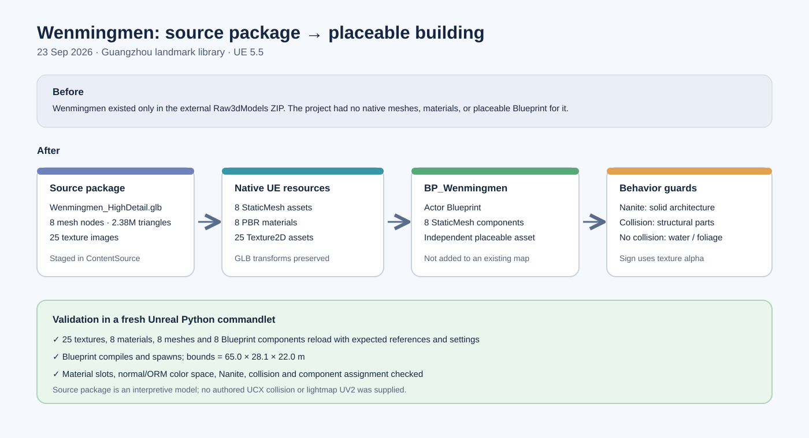

# Wenmingmen building import

## Intent

Import the Wenmingmen high-detail model from `/Volumes/M2/Works/Raw3dModels/Wenmingmen_UE5_Asset_Package.zip` and make it a placeable project building Blueprint.

## Changed behavior

- Staged the package's high-detail GLB, 25 texture images, reference image, manifest, readme, and procedural source in `ContentSource/GuangzhouLandmarks/Wenmingmen/`. The smaller interpretive preview GLB was not imported.
- Imported eight native static meshes, 25 textures, and eight PBR materials under `/Game/Assets/Environment/GuangzhouLandmarks/Wenmingmen`. The package also produced one Interchange scene-import metadata asset.
- Created `/Game/Assets/Environment/GuangzhouLandmarks/Wenmingmen/BP_Wenmingmen` as an Actor Blueprint with eight mesh components and the GLB's transforms. Solid architectural meshes use Nanite. Stone, limestone, wood, and iron use complex collision; roof, water, foliage, and inscription have no collision. The inscription material uses the texture alpha.
- Added repeatable staging, import, and validation scripts plus a checked-in native-asset manifest. The 129 MB source GLB uses Git LFS.

## Validation

- `python3 -m py_compile Scripts/PrepareWenmingmen.py Scripts/ImportWenmingmen.py Scripts/ValidateWenmingmen.py` passed.
- UE 5.5 Python import commandlet created the assets. A separate fresh UE commandlet reload validated all 25 textures, eight materials, eight meshes, and eight Blueprint components, including color space, mesh sections, material slots, Nanite, collision, and component references.
- The compiled Blueprint spawned successfully with 6500 × 2805 × 2199 cm bounds. `git diff --check` passed.

## Limits

The supplied geometry is an interpretive reconstruction. The package has no UCX collision or lightmap UV2, and the model was not placed into an existing level. The host's Zen derived-data cache returned HTTP 507 during import, but both native asset saving and the independent reload validation completed successfully.
