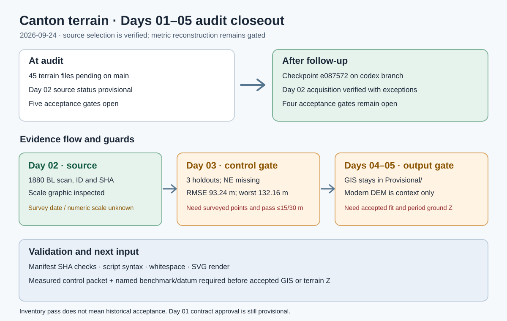

# Canton terrain Days 01–05: audit closeout and evidence gates

## Intent

Review the external handoff against the repository and advance every Days 01–05 action supported by the available evidence.

## Changed behavior

- Preserved the terrain-only audit snapshot in local checkpoint `e087572` on `codex/canton-terrain-days-01-05`.
- Closed Day 02's source-acquisition criterion after inspecting the original map's scale graphic and recording the unknown numeric scale and survey date. This does not accept metric map placement.
- Inventoried three current UE gate Blueprint envelopes and grounding conventions as asset metadata, never as survey control.
- Registered the official Guangzhou-to-1985 height-system relation, with its conditional use; left the Qing stratum and 1880 ground Z unconverted.
- Documented missing NE map-check coverage and a measured-control/height handoff. Retained the failed transform and all six derived GIS layers under `GIS/Provisional/`.
- Updated the validator to distinguish verified source selection from four remaining acceptance gates, and to check the added source and asset records.

## Validation

The deterministic artifact manifest and standard-library validator checked all registered hashes, source status, provisional layer counts, failed-transform guards and absence of accepted GIS. Script compilation, Git whitespace check, package blob identity checks and SVG rendering were run. Their final results are in `QA/Canton_Days_01_05_Execution.md`. The map-control and historical-height gates still require external measurements; the diagram shows those guards.
