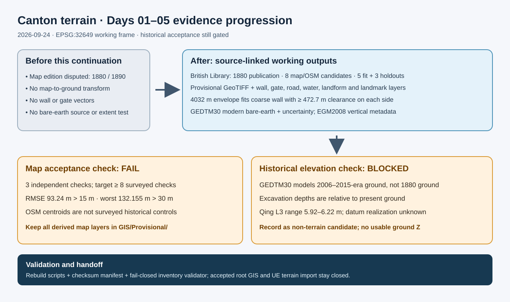

# Canton terrain Days 01–05: provisional georeference and elevation

## Intent

Advance the first five Canton terrain plans past source and tooling gaps while preserving the distinction between a working reconstruction and historically accepted measurements.

## Changed behavior

- Resolved the selected Vrooman map's publication to 1880 from the British Library record; actual survey date and scale remain unknown.
- Built an explicitly failed affine review GeoTIFF from five OSM landmark candidates and three independent candidates. Logged all residuals and retained the 93.24 m RMSE / 132.155 m worst failure.
- Created isolated coarse GIS layers with map-pixel traces, provenance and D confidence. Checked that a 4032 m square contains the provisional wall plus 200 m buffer.
- Acquired GEDTM30 modern bare-earth and uncertainty crops with CC BY 4.0, EGM2008 datum and checksums. Inspected an official excavation report with relative depths and a peer reviewed paper with a 5.92–6.22 m Qing cultural-layer range; registered that range as a non-terrain candidate because its precise datum and period-ground interpretation are unresolved.
- Updated the working coordinate contract, source register, artifact manifest, resource sheets and fail-closed validator. Selected a south-wall working gate district and east-gate fallback, both provisional.

## Validation

The affine and GIS builders completed successfully; raster metadata showed expected dimensions, CRS, vertical tags and scale metadata. The trace overlay was visually inspected against the source scan. `Scripts/validate_canton_terrain_days_01_05.py` checks checksums, failed-gate labels, layer counts, extent clearance and absence of accepted root layers; its final result is in `QA/Canton_Days_01_05_Execution.md`. The independent map and historical Z acceptance gates remain blocked by evidence, as shown in the [diagram](2026-09-24-canton-terrain-provisional-georef-and-elevation.svg).
