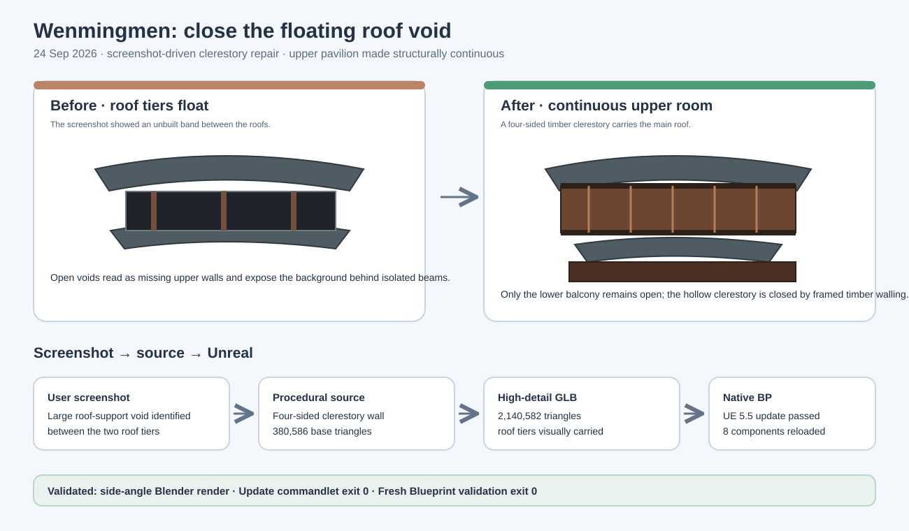

# Wenmingmen clerestory closure

## Intent

The supplied Unreal screenshot exposed a second hollow that the earlier window pass did not reach: the band between the upper roof and lower canopy had no continuous wall mass, so the roofs appeared to float on isolated beams.

## Changed behavior

- Added a continuous four-sided timber clerestory from z 14.66 m to 16.30 m below the main roof.
- Added perimeter top/bottom rails and vertical studs so the band reads as a built upper room.
- Kept only the lower balcony as an intentional open gallery.
- Updated source totals to **380,586 base triangles** and **2,140,582 high-detail triangles**.

## Validation

- Side-angle and roof-detail Blender renders (`Saved/Reports/Wenmingmen/windows-v2-side.png` and `windows-v2-roof-detail.png`) show the roof tiers carried by continuous timber walls with no large through-void.
- `Scripts/UpdateWenmingmen.py` completed in UE 5.5 with exit code 0 and refreshed the native mesh set.
- `Scripts/ValidateWenmingmen.py` completed in a fresh UE process with `WENMINGMEN_IMPORT_COMPLETE`, eight components, and bounds **6500.0 × 2806.9032 × 2199.0076 cm**.
- Python compilation, manifest triangle consistency, SVG XML validation, and `git diff --check` passed. The nine commandlet warnings are unrelated pre-existing Crunch/Aura warnings.

## Scope

This is a reference-guided interpretive reconstruction. The screenshot supplied the visual defect; the fix preserves the reference's open lower balcony while closing the upper roof-supporting room.
