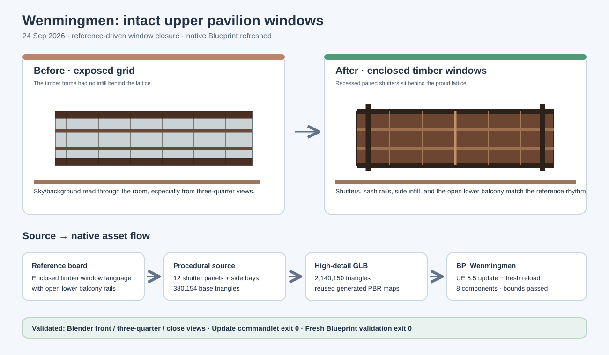

# Wenmingmen pavilion window closure

## Intent

The previous upper pavilion was only a timber grid. From the reference angle, the empty bays read as missing windows and exposed the background through the room. This pass closes the upper story with recessed timber shutter infill while preserving the open lower balcony railing shown in the concept board.

## Changed behavior

- Added recessed paired shutter panels behind all six front bays and six rear bays.
- Added joined sash rails, meeting stiles, vertical shutter planks, and closed end-bay window panels for three-quarter views.
- Kept the lower balcony open with its railing, brackets, and eave rhythm.
- Rebuilt the source at **380,154 base triangles** and **2,140,150 high-detail triangles** while reusing the four generated PBR sets.

## Validation

- Blender produced `Saved/Reports/Wenmingmen/windows-v1-front.png`, `windows-v1-three-quarter.png`, `windows-v1-gate-detail.png`, and `windows-v1-roof-detail.png`; the pavilion close view shows filled window bays with no sky holes.
- `Scripts/UpdateWenmingmen.py` completed in UE 5.5 with exit code 0 and refreshed the changed native mesh set, preserving the eight-component Blueprint contract.
- `Scripts/ValidateWenmingmen.py` completed in a fresh UE process with `WENMINGMEN_IMPORT_COMPLETE`, eight components, and bounds **6500.0 × 2806.9032 × 2199.0076 cm**.
- Python compilation, manifest triangle consistency, SVG XML validation, and `git diff --check` passed. The nine commandlet warnings are pre-existing unrelated Crunch/Aura warnings.

## Scope

This remains an interpretive reconstruction of the supplied concept board, not a measured survey. The visual target is the reference's enclosed timber window language and intact pavilion massing.

