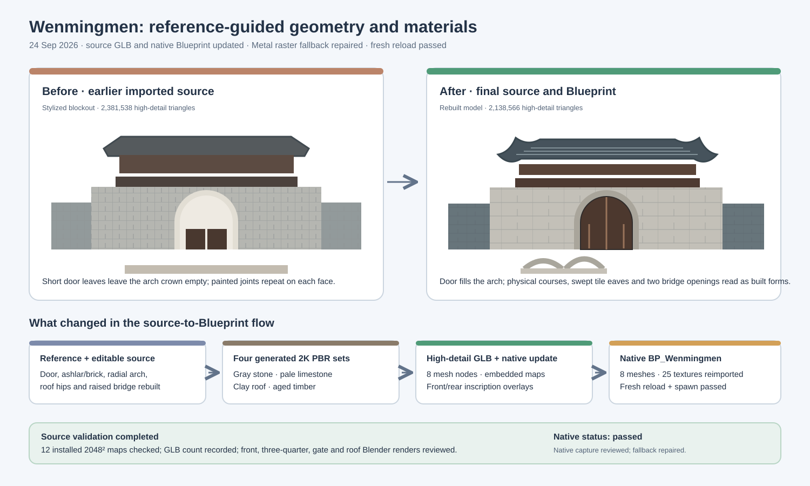

# Wenmingmen reference tuning — source and native Blueprint update

## Intent

Tune the existing `BP_Wenmingmen` building toward the supplied concept board, especially its materials, wall masonry, arched wooden door, roof tiles, and bridge. The supplied board is an artistic reconstruction reference, not a measured or historically verified photograph.

## Before and after

| Area | Earlier imported source | Updated source and Blueprint |
| --- | --- | --- |
| Door and arch | Two low rectangular leaves sat near the back of the tunnel and left the curved upper opening empty. | A closed double timber door follows the arch profile, sits in a recessed frame near the front facade, and has planks, cross rails, studs, and a sill. The arch has radial voussoirs and coursed facing stones. |
| Wall | Thin blocks and a painted joint grid competed, producing implausible repeated wall tiles. | The center has pale dressed ashlar courses; the curtain walls use smaller, darker staggered masonry. Physical joints and continuous stone surfaces carry the wall pattern. |
| Roof and pavilion | Broad, relatively flat roof sheets and simple ribs did not show layered roof tiles clearly. | Hipped roof ends rise at the eaves; overlapping clay pans, rounded joint caps, course rims, and ridge details are modeled on two roofs. Timber brackets and lattice remain visible below. |
| Bridge | A flat approach and weak side arch did not match the reference bridge silhouette. | A raised, gently curved stone deck crosses two modeled arch openings with stone railings. |
| Materials | Procedural stone, roof, and timber maps with regular painted marks. | Four reference-guided generated 2048 × 2048 PBR sets cover gray masonry, pale limestone, charcoal fired clay, and aged wood. The source images and repeat-safe processed BaseColor, Normal, and ORM maps are in `materials_v2/` and `textures/`. |
| Inscription | A main-plaque overlay only. | The main plaque and two five-character side couplets have front and rear transparent overlays. The wording is interpretive and not verified archival lettering. |

The editable base model now has **378,570 triangles**; `Wenmingmen_HighDetail.glb` has **2,138,566 triangles** across eight mesh nodes. Both are interchange sources. The existing `/Game/Assets/Environment/GuangzhouLandmarks/Wenmingmen/BP_Wenmingmen` has been updated from the final source while retaining its asset path and eight component names.

## Changed files and flow

- `ContentSource/GuangzhouLandmarks/Wenmingmen/source/build_wenmingmen.py` builds the revised architectural geometry and can embed the installed PBR maps with `--reuse-textures`.
- `ContentSource/GuangzhouLandmarks/Wenmingmen/source/create_high_detail.py` adds selective subdivision and the front/rear inscription overlays.
- `ContentSource/GuangzhouLandmarks/Wenmingmen/materials_v2/` retains the four generated source images, processing script, preview, and material notes. Twelve processed maps are installed under `textures/` using existing texture stems.
- `ContentSource/GuangzhouLandmarks/Wenmingmen/Wenmingmen_Interpretive.glb` and `Wenmingmen_HighDetail.glb` carry the current source geometry and embedded materials.
- `Scripts/PreviewWenmingmen.py` renders consistent front, three-quarter, gate, and roof comparisons in Blender. `Scripts/UpdateWenmingmen.py` is the in-place UE reimport path; it keeps the native asset paths and eight Blueprint component names.
- `ContentSource/GuangzhouLandmarks/Wenmingmen/README_UE5.md` and `asset_manifest.json` describe the revised source, native validation, and Metal SM5 fallback guard.

## Validation

- The four generated material sources were processed into twelve 2048 × 2048 BaseColor, Normal, and ORM maps. The material package records edge matching, channel checks, and reproducible output hashes in `materials_v2/README.md`.
- The final source manifest reports 378,570 base and 2,138,566 high-detail triangles. Front, three-quarter, gate-detail, and roof-detail Blender renders were produced at 1600 × 1000 in `Saved/Reports/Wenmingmen/final-*.png` and visually inspected against the reference.
- `Scripts/UpdateWenmingmen.py` completed in isolated UE 5.5 Python commandlets with exit code 0. The first update reimported eight static meshes and 25 textures; the final arch contrast pass reimported the changed stone and limestone meshes. Both preserved the eight-component Blueprint contract and reported actor bounds of **6500.0 × 2806.9032 × 2199.0076 cm**. The final serialized update is recorded in `Saved/RawModelImport/Wenmingmen-final-update.log` and `Saved/RawModelImport/Wenmingmen-update.json`.
- A separate fresh `Scripts/ValidateWenmingmen.py` commandlet completed with exit code 0. `Saved/RawModelImport/Wenmingmen-final-validation.log` contains `WENMINGMEN_IMPORT_COMPLETE`, eight components, matching bounds, and no Python errors. This verifies serialized native references and spawning after reload; it is distinct from the earlier [2026-09-23 import validation](2026-09-23-wenmingmen-building-import.md).

## Unreal visual review

The live UE 5.5 Blueprint viewport was inspected after the native reimport. On Metal SM5, the initial default raster fallback produced black triangular holes in the wall; `Scripts/FixWenmingmenFallback.py` and the import/update guards changed the five Nanite-enabled meshes to full-resolution `PERCENT_TRIANGLES=1.0` fallback with relative error `0.0`. The repaired native capture is `Saved/Reports/Wenmingmen/native-blueprint-front.png`; its log records source/fallback triangle counts and temporary-actor cleanup from 0 to 0. The repaired viewport shows continuous wall courses, intact roof tiles, and the closed fitted door. The final darker arch-vouser geometry is also present in the final Blender gate-detail render and final serialized source update. The GUI capture uses temporary actors only and does not save a map.

## Limits

The concept board is interpretive. Dimensions, inscription text, masonry arrangement, and surface maps are reconstructed rather than historically surveyed. The GLB does not add authored UCX collision, lightmap UV2, HLODs, or material instances; those remain native-project follow-up work even though the current collision, Nanite fallback, material references, and placement were validated.
