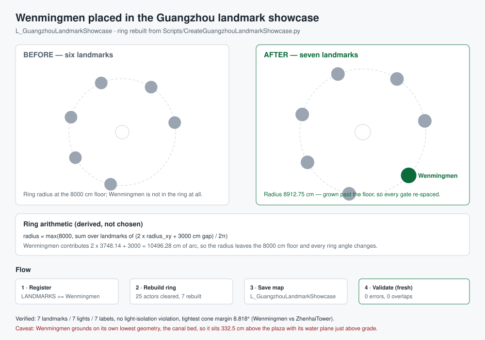

# Wenmingmen placed in the Guangzhou landmark showcase



## Intent

Place the tuned `BP_Wenmingmen` in `/Game/Assets/Environment/GuangzhouLandmarks/L_GuangzhouLandmarkShowcase`,
alongside the other Guangzhou landmarks. The level is generated, not hand-edited, so this means
registering Wenmingmen in the builder and rebuilding the ring.

## Changed behaviour

- `Scripts/CreateGuangzhouLandmarkShowcase.py`
  - Added a `LANDMARKS` entry: `("Wenmingmen", "Wenmingmen/BP_Wenmingmen", "Wenmingmen (Wenming Gate)", 0.0)`.
    Wenmingmen follows the same local **-Y front** convention as the other gates (its door and plaque
    sit on -Y), so it needs **no facing offset**.
  - Module docstring updated to name Wenmingmen among the placed landmarks.
  - `MANIFEST` was the absolute Windows path `C:/Git/AuraProj/Saved/RawModelImport/guangzhou-landmark-showcase.json`.
    On this machine `Path.mkdir` therefore created a literal **`C:` directory** relative to the
    process working directory instead of writing the placement manifest into the project — which is
    why no placement manifest existed anywhere. It is now project-relative
    (`<project>/Saved/RawModelImport/guangzhou-landmark-showcase.json`).
- `Scripts/ValidateGuangzhouLandmarkShowcase.py`
  - Added `Landmark_Wenmingmen` to `EXPECTED_LABELS`. The per-landmark light labels are derived from
    that list, so the landmark and its light have to move together.
  - The same `C:` path bug was fixed for `PLACEMENT_MANIFEST` (read) and `MANIFEST` (the validation
    report, which had been landing in a literal `C:` directory inside
    `Engine/Binaries/Mac/`). The stray tree was removed and the report moved into the project.

### Ring arithmetic (derived, not chosen)

```
radius = max(MIN_RADIUS_CM, sum over landmarks of (2 * radius_xy + GAP_CM) / 2pi)
```

Wenmingmen contributes `2 x 3748.14 + 3000 = 10496.28 cm` of arc. With seven landmarks the radius is
**8912.75 cm**, which lifts the ring off the 8000 cm floor it had been pinned to, so **every**
landmark's ring angle and position changed — that is arithmetic, not a regression.

## Verification

- **Rebuild.** `CreateGuangzhouLandmarkShowcase.py` ran in an isolated UE 5.5 Python commandlet and
  exited 0; the map was written at 08:38:45. Log:
  `Saved/RawModelImport/showcase-wenmingmen-rebuild.log`. The placement manifest
  (`Saved/RawModelImport/guangzhou-landmark-showcase.json`) reports `passed: true`,
  `actors_removed_before_rebuild: 25`, `ring_radius_cm: 8912.75`, `text_labels: 7`, and seven
  landmarks with seven lights:

  | label | yaw | location (cm) | height (cm) | radius_xy (cm) |
  | --- | ---: | --- | ---: | ---: |
  | Landmark_Zhengnanmen_HighFidelity | -79.745 | 8770.36, 1586.80, 0.00 | 2302.50 | 1595.31 |
  | Landmark_Xiaobeimen_AAA_V3 | -32.819 | 4830.62, 7490.14, 29.08 | 2253.08 | 2704.24 |
  | Landmark_Guidemen_ReferenceRepaired | 23.190 | -3509.63, 8192.66, 24.00 | 1967.50 | 3008.32 |
  | Landmark_Wuxianmen_V5_FullPBR | 73.801 | -8558.91, 2486.38, 8.00 | 1721.00 | 1864.67 |
  | Landmark_GreatNorthGate | 118.702 | -7817.60, -4280.44, 0.00 | 2476.02 | 2120.00 |
  | Landmark_ZhenhaiTower | 167.428 | -1940.05, -8699.04, 0.00 | 2085.00 | 2459.54 |
  | **Landmark_Wenmingmen** | **226.619** | **6477.86, -6121.64, 332.50** | **2199.01** | **3748.14** |

- **Validation.** A separate fresh `ValidateGuangzhouLandmarkShowcase.py` commandlet exited clean.
  Its report (`Saved/RawModelImport/guangzhou-landmark-showcase-validation.json`) gives
  `errors: []`, `overlaps: []`, `light_isolation: []`, with 7 landmark lights, 7 text labels, 2
  directional lights, 1 sky light, 1 sky atmosphere, 1 player start and 1 static mesh actor. Every
  per-landmark light has a positive nearest-neighbour cone margin; the tightest is **8.818 deg**
  (Light_Wenmingmen vs Light_ZhenhaiTower).
- Wenmingmen's measured height in the level is **2199.01 cm**, matching the Blueprint bounds
  (6500.0 x 2806.9032 x 2199.0076 cm), so the reimported model is what got placed.

## Caveats

- **The running editor must reload the level.** An editor instance had `L_GuangzhouLandmarkShowcase`
  open throughout, so its in-memory copy is now stale. Reload the level (or reopen it) before
  reviewing; do **not** save the stale copy over the rebuilt one.
- **Wenmingmen grounds on its own lowest geometry, which is its canal bed.** The builder grounds each
  landmark by `world_min_z = GROUND_TOP_Z`, and Wenmingmen's lowest point is the canal bed at
  -332.5 cm, so the actor sits at `z = 332.5` and its water plane lands ~52 cm above the plaza. That
  is the level's existing convention applied uniformly, not a Wenmingmen-specific rule. If the gate
  should instead sit at plaza level with its canal cut into the ground, that needs a per-landmark
  ground offset plus a matching change to the validator's grounding assertion — not done here.

## Limits

The showcase is a display ring, not a game level. The concept board remains an interpretive
reference. The GLB still supplies no authored UCX collision, lightmap UV2, HLODs or material
instances.
