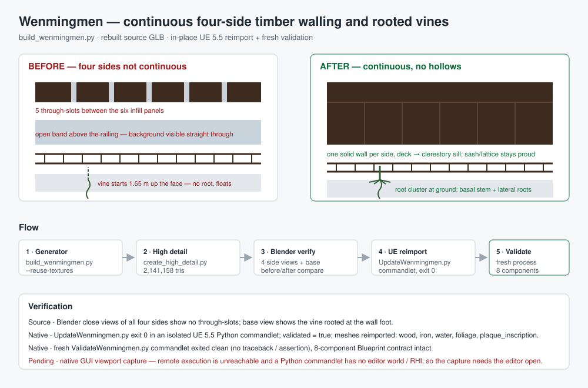

# Wenmingmen — continuous four-side timber walling and rooted vines



## Intent

Two defects reported against `BP_Wenmingmen`, on top of the earlier pavilion-window and
clerestory passes:

1. **The four side timber walls were not continuous and were hollow.** The upper pavilion's
   four sides were built from separate infill panels plus a separate clerestory band, which
   left a through-slot between every pair of panels, an open corner gap at each end, and an
   unclosed band above the balcony rail. From the front or the side the background was visible
   straight through the building.
2. **The climbing vines had no roots.** Each stem started 1.65 m up the wall face and simply
   ended, so the vines appeared to float rather than grow.

The supplied concept board remains an artistic reference, not a measured survey.

## Changed behaviour

- `ContentSource/GuangzhouLandmarks/Wenmingmen/source/build_wenmingmen.py`
  - The four sides of the upper timber room are now **one continuous closed wall each**, running
    from the pavilion deck (`z = 10.40`) to the clerestory sill (`z = 14.66`): front and rear
    walls span the full `x` width, and the two end walls span the full depth and are extended
    past the front/rear wall centrelines so the corners close by overlap rather than on a
    hairline seam.
  - The per-bay infill panel boxes were removed; the shutter leaves, meeting stiles, sash rails,
    vertical frame posts and lattice members are kept, still proud of the wall, so each side
    still reads as joined timber windows rather than blank boarding.
  - The exterior balcony railing is retained as a modelled detail.
  - Each vine now starts at the ground (`z = 0.06`) instead of 1.65 m up the face, and carries a
    **root cluster**: a thickened basal stem plus six short lateral roots spreading along the
    wall foot. Stem segments were raised from 20 to 26 so the taller run still reaches the same
    height.
- Rebuilt source: `Wenmingmen_Interpretive.glb` **381,162 triangles**; `Wenmingmen_HighDetail.glb`
  **2,141,158 triangles** across the eight mesh nodes.
- Native: `/Game/Assets/Environment/GuangzhouLandmarks/Wenmingmen/BP_Wenmingmen` refreshed in
  place; asset paths, the eight mesh names, the eight component names and the material slots are
  unchanged. Blueprint bounds stayed at **6500.0 × 2806.9032 × 2199.0076 cm**.

## Verification

- **Source (Blender, 1600 × 1000).** Close views of all four sides were rendered before and after
  (`Saved/Reports/Wenmingmen/inspect/before-close-{front,rear,left,right}.png` and
  `after-close-{front,rear,left,right}.png`) plus `before/after-base-vines.png` and
  `before/after-pav-corner.png`. The before views show the bright through-slots and the open band;
  the after views are solid, and the vine is planted at the wall foot.
- **Native reimport.** `Scripts/UpdateWenmingmen.py` ran in an isolated UE 5.5 Python commandlet
  and exited 0. `Saved/RawModelImport/Wenmingmen-update.json` reports `validated: true`, no texture
  refresh, and `meshes_reimported: [wood, iron, water, foliage, plaque_inscription]`; the Interchange
  log confirms each of those static meshes was rebuilt. Log:
  `Saved/RawModelImport/Wenmingmen-wall-update.log`.
- **Native fresh reload.** A separate `Scripts/ValidateWenmingmen.py` commandlet exited clean with
  no traceback or assertion, re-loading and spawning the saved eight-component Blueprint. Log:
  `Saved/RawModelImport/Wenmingmen-wall-validation.log`.
- The full-resolution Metal SM5 Nanite fallback remains enforced in both the import and update
  scripts, and is asserted during validation.

## Pending

**Native GUI viewport capture is not done.** `Saved/Reports/Wenmingmen/CaptureNativeBP.py` needs an
editor world and a live RHI, so it cannot run in a Python commandlet; and UE Python remote execution
could not discover the running editor from the shell (its multicast socket is bound to
`127.0.0.1:6766` but does not answer discovery), so it could not be driven remotely either. The
capture should be run with the editor open:

```sh
UE_ENGINE_ROOT=/Volumes/M2/Engine/UE_5.5 \
  python3 Scripts/remote_run.py Saved/Reports/Wenmingmen/CaptureNativeBP.py
```

or by typing `py /Volumes/M2/Works/AuraProj/Saved/Reports/Wenmingmen/CaptureNativeBP.py` into the
editor's Python console. Until then, the native evidence is structural (commandlet reimport plus a
fresh reload validation), not visual.

## Limits

The concept board is interpretive. Dimensions, masonry arrangement, inscription text and surface
maps are reconstructed rather than surveyed. Closing the four sides deliberately removes the open
gallery look of the earlier passes in favour of a sealed timber room, which is what was asked for;
the exterior railing is now a detail against a solid wall. The GLB still supplies no authored UCX
collision, lightmap UV2, HLODs or material instances.
