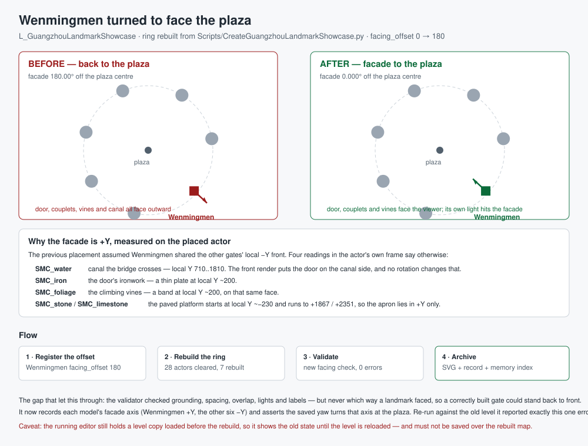

# Wenmingmen turned to face the plaza



## Intent

The user asked for `BP_Wenmingmen` to be placed in
`/Game/Assets/Environment/GuangzhouLandmarks/L_GuangzhouLandmarkShowcase` "with a
reasonable position". It was already in the ring — registered in the builder and
rebuilt on 2026-09-24 — so the job became checking that the position actually was
reasonable rather than assuming the previous placement had it right.

It did not. The gate stood **back to front**: its facade faced away from the plaza
centre, so a visitor would have seen the blank rear wall while the gate's own
accent light lit that rear wall.

## Changed behaviour

- `Scripts/CreateGuangzhouLandmarkShowcase.py`
  - Wenmingmen's `LANDMARKS` entry changed from `facing_offset 0.0` to **`180.0`**.
    Every other gate keeps `0.0`. The comment records the four measurements the
    decision rests on, because the entry now deliberately breaks the ring's
    stated "front on local -Y" convention.
- `Scripts/ValidateGuangzhouLandmarkShowcase.py`
  - New `FACADE_LOCAL_AXIS` table and a new **facing check**. Nothing in this
    validator previously tested orientation: a landmark could be grounded,
    spaced, overlap-free, correctly lit and correctly labelled and still be
    turned the wrong way — which is exactly how this defect survived the
    previous validation pass with `errors: []`.
  - The check rotates each model's recorded facade axis by the actor's saved yaw
    and measures the angle to the inward (plaza) direction. A landmark more than
    `FACING_TOLERANCE_DEG` (1.0°) off the plaza is an error.
  - `FACADE_LOCAL_AXIS` holds `(0.0, -1.0)` for the six gates built before
    Wenmingmen and `(0.0, +1.0)` for Wenmingmen. A landmark with no entry is a
    warning, not a silent pass.

### Why Wenmingmen's facade is local +Y

The 2026-09-24 placement asserted that Wenmingmen "follows the same local -Y front
convention as the other gates (the door and plaque sit on -Y)". That was never
measured. Four readings taken on the placed actor, in the actor's own frame, say
the opposite:

| Reading | Measurement |
| --- | --- |
| `SMC_water` — the canal the bridge crosses | local Y **710..1810** |
| `SMC_iron` — the door's ironwork | thin plate at local Y **~200** |
| `SMC_foliage` — the climbing vines | band at local Y **~200** |
| `SMC_stone` / `SMC_limestone` — the paved platform | starts at local Y **~-230**, runs to **+1867 / +2351** |

The canal reading is the load-bearing one, and it is rotation-invariant: the
Blender front render (`Saved/Reports/Wenmingmen/final-front.png`) shows the closed
timber door, the couplets and the vines on the **same side of the model** as the
bridge and canal. No rotation of the model can separate them, so the door is on
the canal side — and the canal is on +Y. The ironwork and vines independently
place the door on that same face, and the paved platform only extends to +Y, so
the apron the gate is approached over is on +Y as well.

The plaza side is local **-Y**: the per-building light is built on the plaza side
by construction and measures local Y **-5248**. Hence a facade on +Y with
`facing_offset 0` points 180° away from the plaza.

## Verification

- **The check catches the old state.** Run against the level as it stood before
  this change, the new facing check reported exactly one error and nothing else:

  ```
  Landmark_Wenmingmen: facade faces 180.00 deg away from the plaza centre
  - the landmark is turned the wrong way
  ```

  All six other landmarks reported `0.000 deg`. That is a direct demonstration
  that the defect was real and that the new check detects it.

- **Rebuild.** `CreateGuangzhouLandmarkShowcase.py` ran as an isolated UE 5.5
  Python commandlet and exited 0; the map was written at 00:01:49. Log:
  `Saved/RawModelImport/showcase-wenmingmen-facing-rebuild.log`. The placement
  manifest reports `passed: true`, `actors_removed_before_rebuild: 28`,
  `ring_radius_cm: 8912.75`, `text_labels: 7`. **Only Wenmingmen's rotation
  changed** — every landmark's location is identical to the previous rebuild
  (its geometry is unchanged, so the derived radius and every ring angle hold),
  which is why this is a one-parameter fix rather than a re-layout.

- **Validation.** A fresh `ValidateGuangzhouLandmarkShowcase.py` commandlet exited
  0 and reports `errors: []`, `warnings: []`, `overlaps: []`,
  `light_isolation: []`, 7 landmarks / 7 lights / 7 labels, angular gaps
  44.914°–59.117°, spread 100%. Every facade now measures **0.000°** off the
  plaza, Wenmingmen included.

## Caveats

- **The running editor must reload the level.** An editor instance has
  `L_GuangzhouLandmarkShowcase` open from a load taken *before* the 2026-09-24
  rebuild, so its in-memory copy lacks Wenmingmen entirely and does not show this
  change either. Reload the level; do **not** save the stale copy over the rebuilt
  map. UE Python remote execution was unreachable from this session (no discovery
  answer on the multicast group), so the level could not be reloaded here.
- **The other six gates were not re-measured.** Their `-Y` facade axis is carried
  over from the builder's documented convention, not re-derived here. The new
  facing check asserts it, so a rebuild will now fail loudly if that convention is
  wrong for one of them — but that has not been tested against the models.
- **This does not change grounding.** Wenmingmen still grounds on its lowest
  geometry with actor Z 332.5. Measured with the components' world transforms, its
  rendered geometry spans world Z **0.0 → 2199.01**, so its stone base sits exactly
  on the plaza and the earlier worry that it floats 332.5 cm does not hold: 332.5
  is the actor origin, not the geometry. Its canal water surface sits at world Z
  ~48.5–56.5, just above grade. The Blueprint bounds (6500 × 2806.90 × 2199.01 cm)
  match the placed actor exactly.

## Limits

The showcase is a display ring, not a game level. Wenmingmen's canal reads as a
shallow water sheet on the plaza rather than a cut channel, because the ground
plane is a flat quad and the model is grounded on its base. Cutting the canal into
the ground would need a per-landmark ground offset plus a matching change to the
validator's grounding assertion. The concept board remains an interpretive
reference.

## Measurement notes (traps this job hit)

- The six Wenmingmen components are plain `StaticMeshComponent`s carrying a **-90°
  component rotation**, not HISM instances. Reading `relative_location + mesh
  bounds Z` therefore returns nonsense (it reported a local Z floor of -2351 cm);
  the correct reading transforms the mesh bounds corners by each component's
  **world transform**. Confirmed by matching the Blueprint bounds exactly
  (6500 × 2806.90 × 2199.01).
- `unreal.PrimitiveComponent.bounds` is **not exposed** to Python, and
  `get_editor_property("relative_transform")` fails on these components. The
  world-transform route is the one that works.
- The validator's existing `rendered_geometry` diagnostic still reports
  `rendered_min_z` of about -2019 for Wenmingmen. That is the same known
  plain-`StaticMeshComponent` measurement split already documented in that file;
  it is reported, not asserted on, and it is not evidence about grounding.
