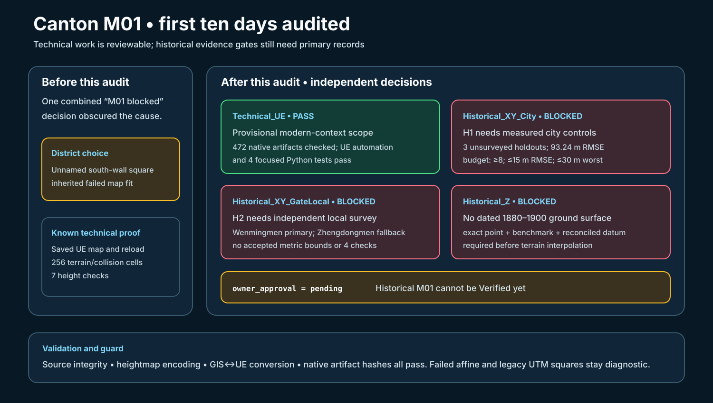

# Canton M01 evidence gate audit — 2026-09-26

## Intent

Carry the first ten days forward under the revised H1/H2 plan, validate the implemented technical path, and report precisely which historical acceptance gates remain open.

## Changed behavior

- The M01 readiness check now reports `Technical_UE`, `Historical_XY_City`, `Historical_XY_GateLocal`, `Historical_Z`, and Day 01 `owner_approval` separately, and rejects unexpected evidence promotions.
- Day 05 now ranks the named Wenmingmen district first and Zhengdongmen second using municipal historical location descriptions and existing project assets. Their metric bounds remain unset. The older unnamed UTM squares are retained as diagnostic technical locations.
- The M01 review and uncertainty log now identify H1, H2, historical Z, and approval as distinct blockers. `Data/H1_Source_Comparison.csv` records the unacquired 1907 and 1900 source leads without treating them as controls.
- The source, provisional, and native artifact manifests were refreshed after the documentation and readiness-check changes.

## Validation

- `python3 Scripts/test_canton_source_manifest.py`: inventory consistent, zero integrity errors.
- `Saved/TerrainTools/venv/bin/python Scripts/test_canton_heightmap_contract.py`: two tests passed.
- `Saved/TerrainTools/venv/bin/python Scripts/test_canton_ue_import_contract.py`: two tests passed.
- `python3 Scripts/test_canton_m01_readiness.py`: 472 native artifacts checked; technical provisional pass, H1/H2/Z blocked, approval pending.
- SVG rendered and inspected; `git diff --check` passed.

Historical M01 remains blocked until the measured controls, local gate network, datum-backed walking surface, and owner approval satisfy the unchanged acceptance budget.
