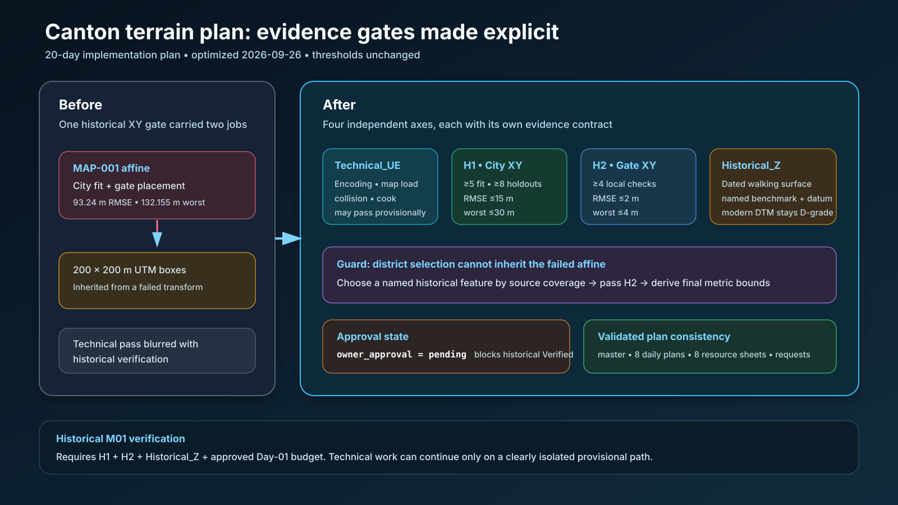

# Canton plan H1/H2 optimization — 2026-09-26

## Intent

Apply the blocker review to the canonical Canton 20-day plan and its daily execution sheets without weakening the historical acceptance thresholds.

## Changed behavior

- Replaced the single historical XY decision with four independent status axes: `Technical_UE`, `Historical_XY_City` (H1), `Historical_XY_GateLocal` (H2), and `Historical_Z`.
- Assigned the existing city budget to H1 and the metre-level local budget to an independent H2 survey/conservation/archaeological network.
- Kept MAP-001 and its failed affine immutable as layout/provenance and audit evidence.
- Labeled failed-transform-derived 200 × 200 m UTM boxes `PROVISIONAL_DIAGNOSTIC_ONLY`; final bounds follow an accepted H2 frame.
- Added an explicit versioned working budget and `owner_approval` state. Pending approval allows provisional technical work but blocks historical `Verified` decisions.
- Updated Days 01, 03, 05, 08, 10, 11, 14 and 20 plus their resource sheets, the survey handoff, source requests and candidate registers.

## Validation

- Confirmed canonical axis names and thresholds appear in the master plan, affected daily plans, resource sheets and acceptance budget.
- Parsed the new source-lead and district-candidate CSV files successfully.
- Checked local Markdown links in the changed planning documents.
- Rendered and inspected the archived SVG summary.
