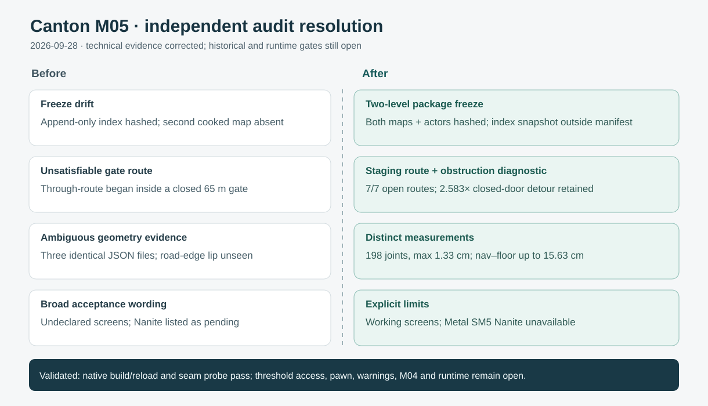

# Canton M05 independent audit resolution — 2026-09-28

The independent review identified twelve real or substantively real gaps. The package freeze no longer hashes the append-only visual index and now includes both cooked Canton levels, their World Partition actor packages and M01 evidence. The stale gate view was replaced with the newer capture; the initial `Build_Result.json` is marked as a superseded snapshot. Versioned working navigation and grade screens were added without claiming owner approval.

The closed Wenmingmen doors make through-gate navigation impossible. The revised intended route stops at a district-side staging point about 6 m north of the gate; seven open/staging routes pass, while the old 2.583× through-gate detour remains an obstruction diagnostic. A nearer stop about 2 m from the face still detoured 2.905× and remains open. Native validation now requires exact instance counts and measures 198 slab-joint corners, with a 1.33 cm maximum step. A separate seam report replaces the byte-identical duplicate. Navigation path corners were traced to actual floor actors; gaps reach 15.63 cm and no clearance budget or pawn test exists. A section view records the 7 cm slab underside gap and 11 cm shoulder lip as unfinished blockout geometry. Gate collision warnings remain unwaived; Nanite is unavailable for the gate on the declared Metal SM5 host.

Validation: AuraEditor Mac Development build passed; fresh native review, distinct seam probe and revised traversal runner passed their guarded checks. The package manifest and freeze test, district contract, runner failure tests, link audit, archive SVG render and `git diff --check` were run before delivery. The exact outputs are in [the disposition](../../../Review/M05_Independent_Audit_Disposition.md) and [handoff](../../../Review/M05_Final_Handoff.md). H1/H2/historical Z, owner approval, threshold pawn clearance, final edge/art, Development runtime and World Partition streaming remain open.
