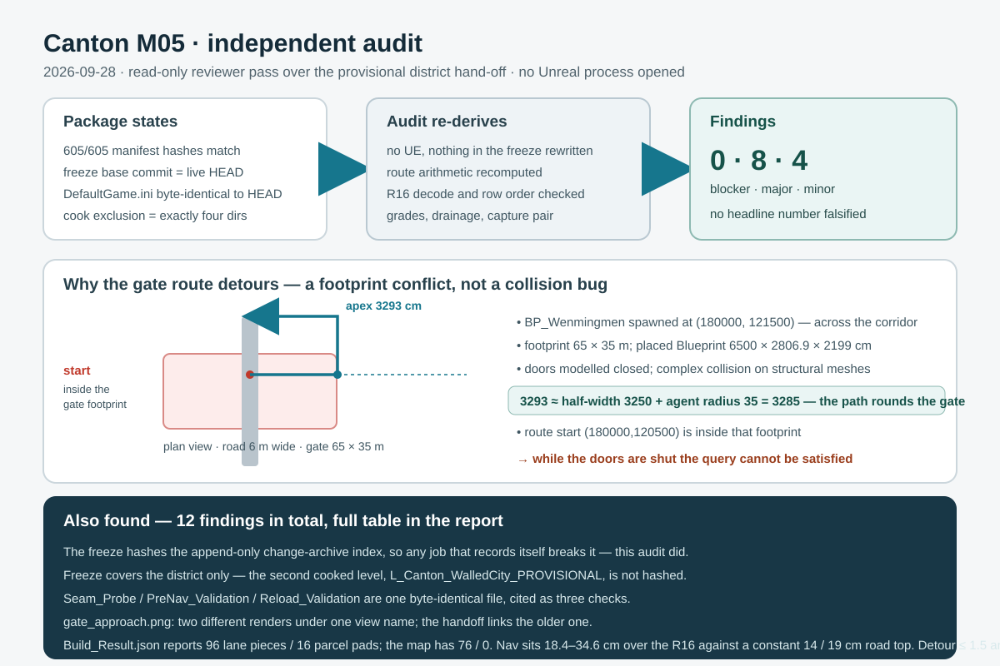

# Canton M05 independent audit — 2026-09-28

## Intent

Review the M05 Canton provisional district hand-off from the **reviewer** side rather than the
author's side: re-derive every claim that can be re-derived from the retained artifacts, and hand
the implementer a concrete revision list. The delivery was previously reviewed only by the agent
that produced it, so a pass that trusts nothing is the missing control.

## Changed behaviour

Nothing in the delivered package was modified. The job **added**:

- `Scripts/audit_canton_district_handoff.py` — a read-only auditor. It opens no Unreal process and
  writes nothing into the frozen package, so it can be re-run as a regression test after the
  revisions. It verifies manifest hashes, freeze currency, handoff link resolution, duplicate
  evidence, route-matrix arithmetic, R16 decode and row order, drainage monotonicity, the wetness
  A/B pair, and then the six claim-level checks below.
- `Review/M05_Independent_Audit_Findings.md` — the report handed back to the implementer.
- `Review/M05_Independent_Audit_Findings.json` — its machine-readable companion.

## What the audit established

**Confirmed sound (do not redo):** 605/605 manifest hashes matched at audit time; freeze
`base_commit` equals live `HEAD` with current manifest and handoff hashes;
`Config/DefaultGame.ini` byte-identical to its `HEAD` blob with exactly four
`DirectoriesToAlwaysCook` entries; every `nav_detour_ratio` recomputes from the raw path lengths;
the R16 decode `(code−32768)·50/128` and its south-first row order match the C++ decoder and the
profile script; all three drainages are monotonic at 4 m steps; the wetness pair is a clean A/B.
No headline number could be falsified.

**Findings — 0 blocker, 8 major, 4 minor.** The one that matters most closes an open question:

- **The gate route is a footprint conflict.** `BP_Wenmingmen` is spawned at `(180000, 121500)`,
  across a 6 m corridor, with a declared 65 × 35 m footprint and a placed Blueprint of
  6500.0 × 2806.9 × 2199.0 cm. The detour's furthest-east point is **3293 cm** from the road
  centre; the gate's east face is at 3250 cm and the UE default nav agent radius is 35 cm —
  **3250 + 35 = 3285 cm**, an 8 cm agreement. The package models a **closed** double timber door
  with complex collision, and the route's own start lies inside the footprint. The 2.583× detour
  is therefore architectural, not a collision bug to simplify.

The rest are about what the package proves about itself: the freeze hashes the **append-only
change-archive index**, so any job that records itself — as AGENTS.md requires — invalidates the
freeze, and this audit moved exactly that one row; the second cooked level
(`L_Canton_WalledCity_PROVISIONAL`) is absent from the frozen manifest; `Seam_Probe.json`,
`PreNav_Validation.json` and `Reload_Validation.json` are one byte-identical artifact cited as
three checks; `gate_approach.png` exists as two different renders under one view name with the
handoff linking the older; the frozen `Build_Result.json` still reports 96 lane pieces and 16
parcel pads where the map has 76 and 0; the navigation surface sits 18.4–34.6 cm above the R16
against a constant 14/19 cm road top with no check relating the two; and the `detour ≤ 1.5` and
`grade < 8 %` gates are enforced in code but declared in no versioned budget — with 20 lane pieces
already deleted to satisfy the second.

## Validation

`python3 Scripts/audit_canton_district_handoff.py` — read-only, no Unreal. Reported
`0 blocker / 8 major / 4 minor`; the JSON companion records every re-derived number, including the
per-route navigation-versus-road table. Re-running after the revisions is the regression test.

## Limits

No Unreal process was opened, so the audit re-measures nothing in the map, collision, navigation
build or cook. The gate diagnosis is arithmetic on the placed actor's coordinates, the package's
declared bounds and the recorded detour apex; confirming it needs one fresh-load run with the gate
collision drawn or the doors opened.
