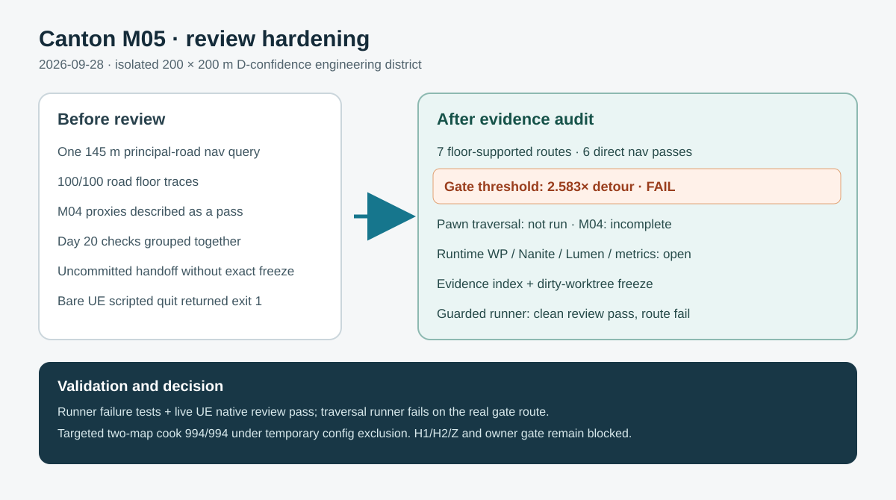

# Canton M05 review hardening — 2026-09-28

The external review identified broad M05 closure language and missing one-to-one evidence. The review was checked against the current plan and actual artifacts; its named blocker-fixed baseline file was not present. The new seven-route fresh-load matrix found floor support throughout but a **2.583× gate-threshold navigation detour**, so Day 14 is partial and physical pawn traversal remains open. M04 is explicitly incomplete; Day 20 runtime, World Partition streaming, Nanite/Lumen and performance subchecks are stated separately. The cook is scoped to a targeted two-map pass under a temporary configuration exclusion.

The handoff now links required evidence, adds a modern-context north–south profile and source-to-prototype change log, and records the exact uncommitted dirty worktree and hashes without claiming a nonexistent final commit. A guarded headless runner normalizes UE's raw exit 1 only with fresh passing JSON, zero-error map check and completed clean shutdown; it fails on the actual gate route.

Validation: `python3 Scripts/test_canton_district_check_runner.py`; `python3 Scripts/test_canton_district_contract.py`; live `python3 Scripts/run_canton_district_check.py review` returned normalized pass after raw UE exit 1; live traversal runner returned failure for the 6/7 route matrix. Existing M01 automation and targeted cook results remain linked in the handoff. Historical H1/H2/Z and owner approval remain blocked/pending.
