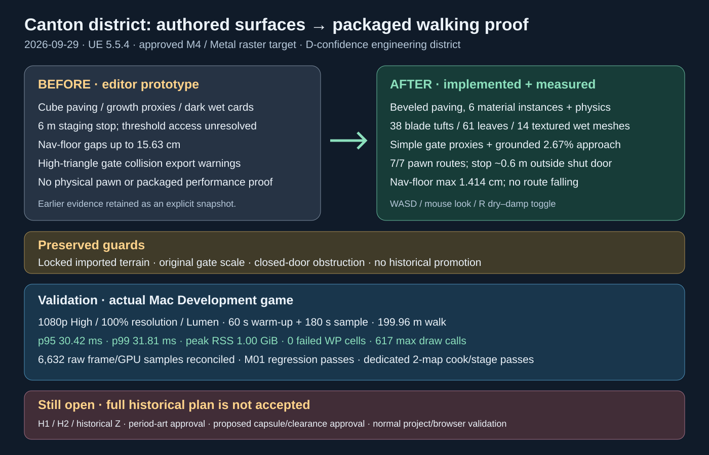

# Canton district runtime implementation — 2026-09-29

Intent: implement the remaining feasible technical work in the revised 20-day plan while preserving historical evidence gates and the existing terrain/gate assets.

Before: cube paving and vegetation, wet cards, staging-only gate access, high-complexity collision export, nav-floor outliers, no packaged pawn/performance evidence.

After: generated beveled paving, textured/parameterized/physical materials, grounded road/gate supports, blade foliage and leaf litter, localized textured wetness/toggle, simple gate collision preserving closed doors, finer nav tiles, a map-specific native walking character, strict runtime/cook/stage/sample-audit tooling, and an interactive launcher. The Mac delivery retains app sandboxing and uses the dedicated terrain profile with browser initialization disabled.

Validation: editor/game builds; M01 native automation (1 success); 100 road floor checks and 198 joints (max step 1.3301 cm); seven nav routes (max floor gap 1.414 cm); seven packaged physical routes with no falling; zero-error/zero-warning map checks; shader-safe paired captures; 993/993-package dedicated cook and stage. The actual 1080p High, 100% resolution, Lumen run samples 180 seconds after 60 seconds warm-up: p95 30.425 ms, p99 31.815 ms, GPU p95 29.574 ms, RSS 1.001 GiB, 617 max draw calls, 199.961 m walked, seven streaming levels and zero failed-cell samples. All 6,632 raw samples independently reconcile. Focused Python contracts and checksum/freeze checks are recorded in the current handoff.

The original modern-context R16/terrain and locked base remain unchanged. No historical surface, road placement, species or palette is certified. H1/H2/Z, period-art approval and the separately proposed capsule/clearance criteria remain open. Normal whole-project packaging/browser behavior is outside the dedicated profile; scripted editor quit still requires strict exit normalization. No historical acceptance threshold was lowered. The old rectangular wet-card pixel-count smoke assertion was replaced by a documented localized-darkening check for the new mesh silhouette.

- [Current handoff](../../../Review/M05_Final_Handoff.md)
- [Reproduction and limits](../../../QA/Canton_Continuation/README.md)
- [Packaged performance](../../../QA/Canton_Continuation/Runtime_performance.json)
- [Packaged walking capture](../../../QA/Canton_Continuation/Runtime_performance.png)
- [Revised master plan](../../Plans/Canton_1880_1900_UE5_Terrain_20_Day_Plan.md)
