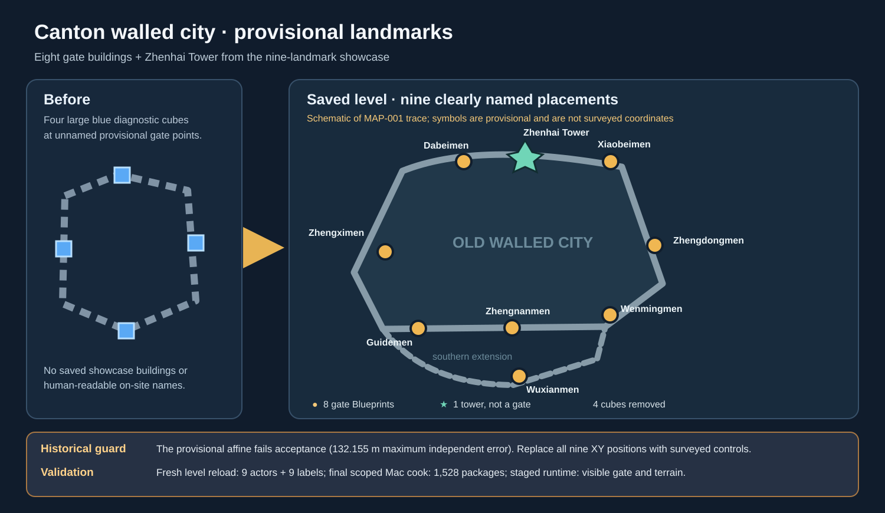
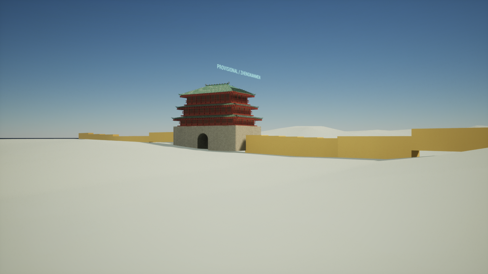
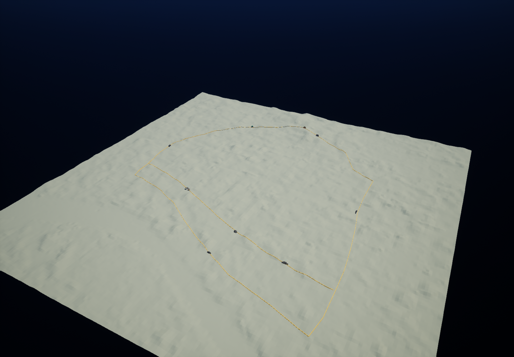

# Canton walled-city showcase landmarks — provisional placement

## Intent and boundary

Place every landmark currently present in the Guangzhou showcase into `/Game/Canton/Provisional/Maps/L_Canton_WalledCity_PROVISIONAL`, while making it unmistakable that these are visual placeholders. The showcase contains **eight gate buildings and Zhenhai Tower**, which is a tower rather than a ninth gate. The nine are Zhengximen, Zhengdongmen, Dabeimen/Great North Gate, Xiaobeimen, Zhenhai Tower, Guidemen, Zhengnanmen, Wenmingmen and Wuxianmen. Their Blueprint paths and provisional coordinates are locked in [the replaceable placement register](../../../Data/Canton_WalledCity_Provisional_Landmark_Placements.json).

The register uses manual points on the MAP-001 trace and the project's failed provisional affine to choose visually plausible wall sectors. It has `historically_accepted: false`: the independent horizontal check has a **132.155 m maximum error**, and surveyed gate controls and historical ground heights are unavailable. The layout follows the broad gate sequence described by the [Guangzhou municipal history page](https://www.gz.gov.cn/zlgz/whgz/content/post_8929405.html) and the [Guangdong account of Zhenhai Tower and the north wall](https://www.gdwsw.gov.cn/wsxsj/content/post_35689.html), but neither source supplies acceptance-grade coordinates. It must be repositioned before any claim of exact historical location.

## Changed behavior

Previously the walled level held four oversized blue diagnostic cubes at unnamed provisional gate points. The placement script removed those cubes, spawned the nine showcase Blueprints as separate spatially loaded World Partition actors, and added nine in-world text labels beginning `PROVISIONAL /`. Outliner names and actor tags also mark each location provisional and historically unverified. The visible building foot is seated to the modern-context R16 height at its centre; its footprint can still cross 0.67–4.68 m of modern relief, so local grading and period threshold elevations remain future work. Zhenhai Tower is explicitly typed `tower_not_gate` in the register.

The source [placement script](../../../Scripts/PlaceCantonWalledCityLandmarks.py) is rerunnable against the register. Replacing the nine preview points and elevations after survey is intended to update the same actors, not create a second set. The fresh-map [validator](../../../Scripts/ValidateCantonWalledCityLandmarks.py) checks the saved actor classes, names, labels, tags, transform, spatial loading and ground anchors.

## Validation

- Fresh-editor reload: **9/9 landmark actors and 9/9 labels**, correct Blueprint classes and transforms; no old diagnostic cubes; existing PlayerStart and walking GameMode retained. The label-facing correction was verified in this reload.
- Final scoped Mac cook: **1,528/1,528 packages** processed successfully; the final staged runtime check is recorded in `QA/Canton_Continuation/`.
- Packaged Mac runtime: actual player view shows the south gate and lit terrain, with a Landscape floor hit, eight streamed levels, zero failed cells and 99.96% nonblack sampled pixels. The final label-facing runtime capture is `QA/Canton_Continuation/Walled_Runtime_Visibility.png`.
- Three citywide/north/south editor overview captures are recorded by `Scripts/CaptureCantonWalledLandmarks.py` in `QA/Canton_Continuation/`.

The isolated editor's process returns code 1 after its scripted checks because Unreal logs `Locale is C.UTF-8 but should be C`; the explicit placement and reload reports both passed. The scoped cook and packaged game process returned code 0.

## Visual evidence

The diagram above is schematic. Each actual numerical placement and its uncertainty remain in the register and `QA/Canton_Continuation/Walled_Landmark_Placement.json`.
