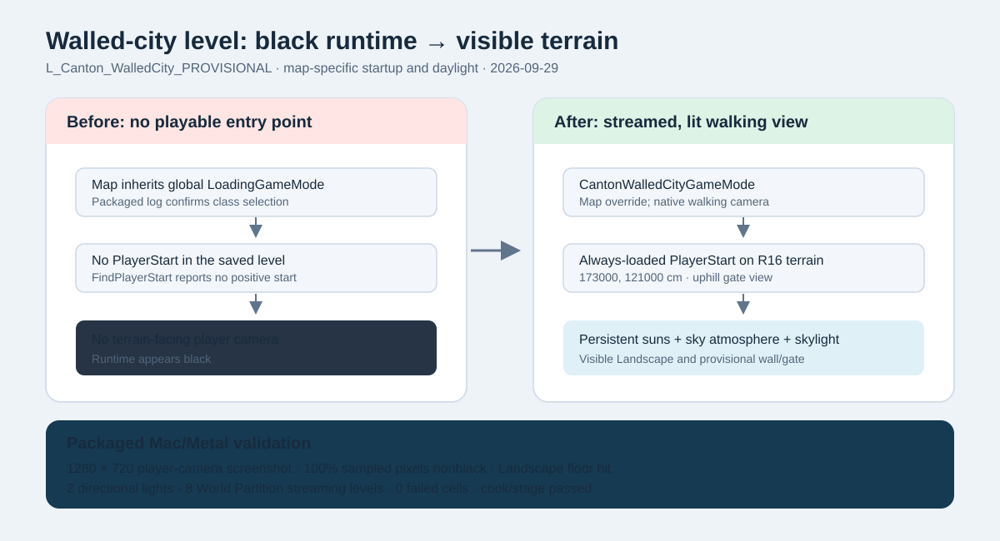

# Canton walled-city runtime visibility — 2026-09-29

Intent: repair the black runtime view of `/Game/Canton/Provisional/Maps/L_Canton_WalledCity_PROVISIONAL` while keeping the terrain and wall/gate overlay provisional.

Before: the packaged game selected the project's global `LoadingGameMode`, and `FindPlayerStart` reported no usable start. The level had two non-spatial directional lights but no sky atmosphere or skylight. The editor's high-altitude viewport and transient SceneCapture checks did not exercise the player camera.

After: the map overrides its GameMode with `CantonWalledCityGameMode`, which spawns the existing native walking character. An always-loaded PlayerStart sits 130 cm above the decoded R16 terrain at (173000, 121000) cm, facing the gate and wall from uphill. Persistent sky atmosphere and movable real-time skylight join the existing two persistent suns. The idempotent [level setup script](../../../Scripts/FixCantonWalledRuntime.py) saves the map and external actors; the [packaged visibility runner](../../../Scripts/run_canton_walled_visibility.py) captures the actual player camera and checks pixel visibility and runtime state. The locked imported terrain and historical status were not changed.

Validation: AuraEditor and Aura Mac Development builds passed; dedicated two-map Mac cook completed 993/993 packages with zero errors and staging passed. In the staged game, the native [runtime report](../../../QA/Canton_Continuation/Walled_Runtime_Visibility.json) confirms the expected GameMode and spawn (173000, 121000 cm), Landscape floor collision, two loaded directional lights, World Partition streaming complete with eight levels and zero failed cells. The [player-camera screenshot](../../../QA/Canton_Continuation/Walled_Runtime_Visibility.png) is 1280 × 720, with 100% nonblack sampled pixels and 5,413 distinct sampled colors; the [runner check](../../../QA/Canton_Continuation/Walled_Runtime_Visibility_Check.json) passes. The scene still intentionally uses diagnostic wall and gate blocks, not historical city art.
