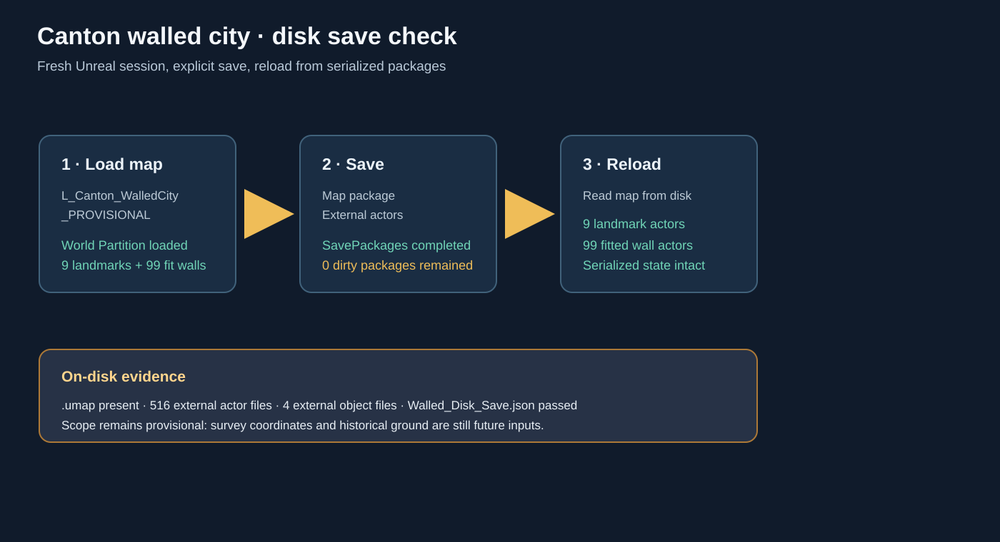

# Canton walled-city disk save verification

A fresh Unreal Editor session explicitly loaded /Game/Canton/Provisional/Maps/L_Canton_WalledCity_PROVISIONAL, saved the map and all dirty Canton provisional packages, then reloaded the map from disk. The save report passed with zero remaining dirty provisional packages.

The reload verified 9 provisional landmark actors and 99 fitted wall actors. The serialized map exists at Content/Canton/Provisional/Maps/L_Canton_WalledCity_PROVISIONAL.umap; the project contains 516 external actor files and 4 external object files for the provisional map. The verification script is [SaveCantonWalledCityToDisk.py](../../../Scripts/SaveCantonWalledCityToDisk.py), with the result in [Walled_Disk_Save.json](../../../QA/Canton_Continuation/Walled_Disk_Save.json).

This confirms the current provisional state is written to disk. It does not change the historical status of the layout; the affine and modern R16 ground remain provisional.
