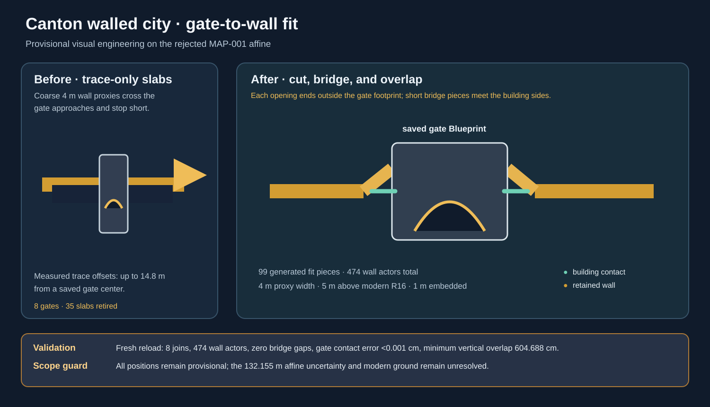
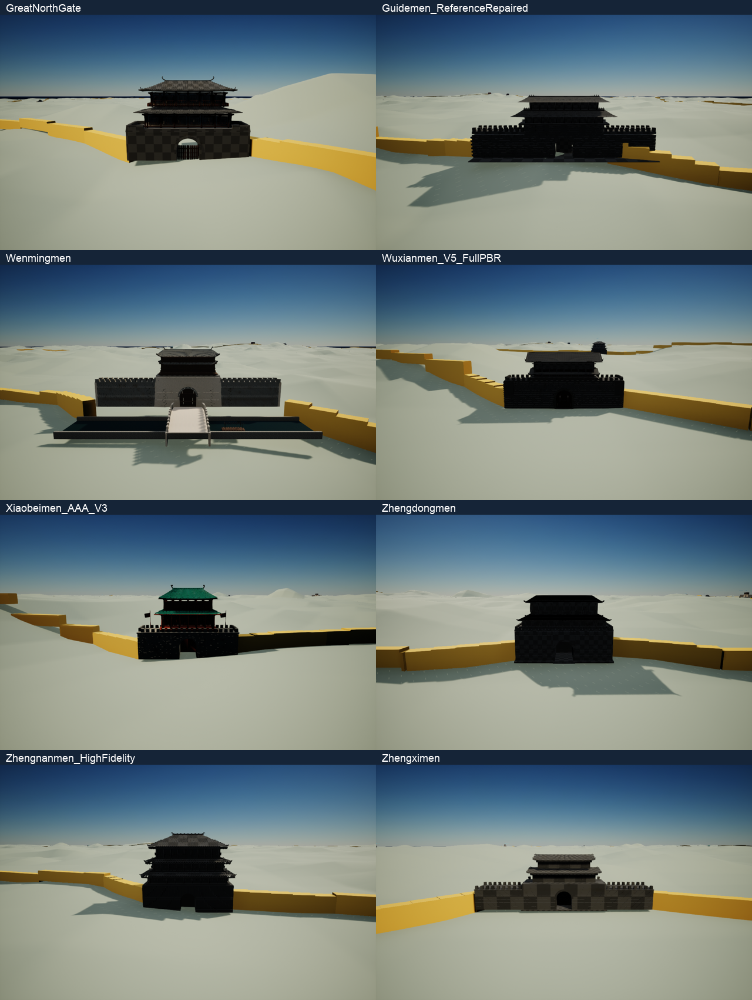

# Canton provisional walls fitted to gate buildings

The walled-city level had 410 coarse wall-marker slabs and eight saved gate buildings. Several gate centers were offset from the coarse trace by 3.2–14.8 m, so a wall marker could cross the gate approach or leave a visible stop short of the gatehouse.

The fit pass keeps every gate transform unchanged. It removes the 35 original slabs that overlap an opening, trims the trace into 16 replacement fragments, and adds 83 short bridge pieces. The bridge pieces are placed from the trace cuts to the measured sides of Zhengximen, Zhengdongmen, Dabeimen, Xiaobeimen, Guidemen, Zhengnanmen, Wenmingmen and Wuxianmen. They are tagged Canton.ProvisionalWallGateFit, placed under Canton/PROVISIONAL_Wall_Gate_Fit, and remain non-colliding visual proxies so the later surveyed wall and gate coordinates can replace them cleanly.

The [fit configuration](../../../Data/Canton_WalledCity_Provisional_Wall_Gate_Fit_Config.json) records the eight joins, widths and source files. The [generated plan](../../../QA/Canton_Continuation/Walled_WallGate_Fit_Plan.json) and [application report](../../../QA/Canton_Continuation/Walled_WallGate_Fit_Application.json) are explicit that the work is provisional and historically unaccepted.

Validation passed in a fresh Unreal load: 474 wall actors (375 retained trace actors plus 99 fitted pieces), eight gate joins, no bridge gaps, less than 0.001 cm gate-contact error, and at least 604.688 cm vertical overlap between adjacent bridge pieces. The gate actors still match their saved provisional transforms. Close-up before/after evidence is in [Wall_Gate_Fit](../../../QA/Canton_Continuation/Wall_Gate_Fit/), including [before contact sheet](../../../QA/Canton_Continuation/Wall_Gate_Fit/Before_ContactSheet.png) and [after contact sheet](../../../QA/Canton_Continuation/Wall_Gate_Fit/After_ContactSheet.png).

The final scoped Mac cook processed 1,529 packages with no errors. The staged runtime check passed with visible terrain/wall/gate, a Landscape floor hit, streaming complete, zero failed cells and 99.97% non-black sampled pixels.

This is a visual fit on the existing modern-context R16 and failed affine. It does not establish historical wall geometry, portal thresholds, or surveyed coordinates.
