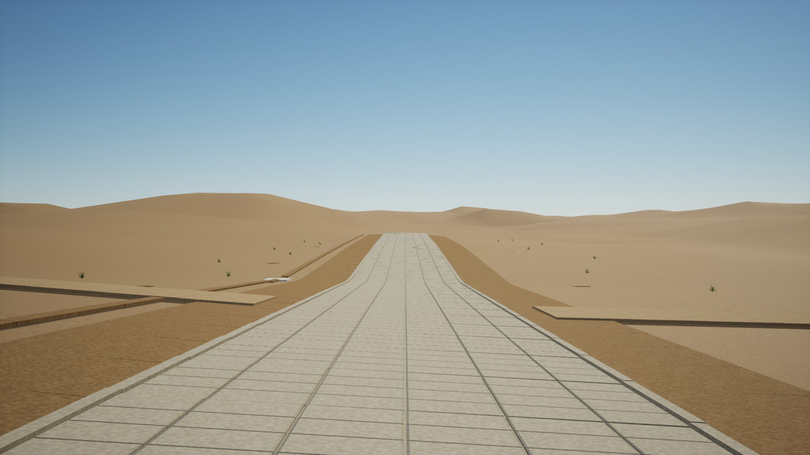

# M05 Canton implementation handoff — 2026-09-29

The remaining **provisional technical district implementation is built and tested** on the approved M4 Mac/Metal target. Seven packaged physical pawn routes and the 1080p High fixed-route performance budget pass. This is still a D-confidence engineering district: historical H1, H2, Z and period-art approval are open. The explicit capsule/nav-clearance criteria have been submitted for owner review; measured passes do not imply that approval. The complete historical 20-day plan is therefore not closed.

Launch [PlayCantonDistrict.command](../PlayCantonDistrict.command) for WASD movement, mouse look and R dry/damp toggle. The staged app is `Saved/CantonContinuation/Stage/Mac/Aura.app`. See [reproduction instructions](../QA/Canton_Continuation/README.md), [open issues](../Data/Open_Issues.csv), and the [pre-continuation handoff snapshot](M05_2026_09_28_Handoff_Snapshot.md).

## Implemented behavior

- The shared Wenmingmen asset, architectural scale and closed doors are preserved. Its district instance uses simple wall/door/arch/rail collision and 41 bridge deck segments instead of exporting the high-triangle visual meshes for navigation. A 2.6696% outer approach, threshold landing, retaining fill and wall foundation connect the source bridge to provisional terrain. The accessible endpoint is about 0.6 m outside the door.
- Recast uses 300 cm tiles, 5 cm horizontal and 1 cm vertical voxels. All seven intended routes have floor support/direct navigation; maximum measured nav-floor difference is 1.414 cm. Through-door navigation still detours 5.029×. The proposed screen remains ≤6 cm; it was not increased to accommodate failures.
- 100 principal slabs use beveled paving geometry and grounded skirts. Six paint targets remain; six parameterized material instances and physical materials use project-authored earth/stone/pebble texture detail. Thirty-eight blade tufts, 61 leaf meshes and 14 localized textured damp meshes replace the cube/card-only treatment. The assets are reproducible from [the generator/manifest](../ContentSource/CantonDistrict/manifest.json), with no period dimensions, species or color claim.
- A map-specific native walking character and automated runtime harness exercise real character movement, support interactive walking, and record frame/GPU/RSS/draw-call/streaming evidence. No along-route teleports are used; each traversal route has a separate start reset. The performance route has one initial reset before warm-up and physical movement throughout its sampling window.
- The original 2017² modern-context R16, 256-component terrain map, locked Base_Imported and empty historical correction layers remain unchanged. Courtyard geometry remains an open-ground reference. No surveyed historical surface or complete city was invented.

## Current validation

| Check | Result | Evidence |
|---|---|---|
| Editor and Mac Development C++ builds | PASS | `Saved/CantonContinuation/BuildEditor8.log`, `BuildGame6.log` |
| M01 native terrain regression | 1 test passed, zero warnings/failures | [Automation report](../QA/UE_Import_Screenshots/Automation_Report.json) |
| Native district reload / map check | PASS; zero map-check errors/warnings | [Reload](../QA/Canton_District/Reload_Validation.json), [runner](../QA/Canton_District/Runner_review.json) |
| Principal road collision / joints | 100 floor checks; 198 joint comparisons; maximum joint step 1.3301 cm | [Reload measurements](../QA/Canton_District/Reload_Validation.json) |
| Navigation / closed door | 7/7 open routes; maximum gap 1.414 cm; closed query detours 5.029× | [Route matrix](../QA/Canton_District/Traversal_Route_Matrix.json) |
| Packaged physical pawn | 7/7 routes; no falling; endpoint errors 25.0–31.2 cm | [Native report](../QA/Canton_Continuation/Runtime_traversal.json), [runner](../QA/Canton_Continuation/Runner_traversal.json) |
| Materials / wet toggle | Fresh shader-safe captures; matched pair changes 1.172% of image and darkens locally | [Capture QA](../QA/Canton_District/Capture_QA.json), [atlas](M03_Material_Atlas.png) |
| Dedicated two-map cook / stage | PASS; 993/993 packages processed, zero remaining; source packaging config unchanged | [Cook](../QA/Canton_Continuation/Delivery_Cook.json), [stage](../QA/Canton_Continuation/Delivery_Stage.json) |
| Packaged performance | PASS; 60 s warm-up + 180 s sample, 1920×1080 High, screen percentage 100, Lumen methods enabled | [Native report](../QA/Canton_Continuation/Runtime_performance.json) |
| Frame / GPU / memory | p95 30.425 ms; p99 31.815 ms; GPU p95 29.574 ms; RSS peak 1,074,511,872 bytes (1.001 GiB) | [6,632 raw samples](../QA/Canton_Continuation/Runtime_performance.csv), [independent reconciliation](../QA/Canton_Continuation/Runtime_Sample_Audit.json) |
| Physical performance route / WP | 199.961 m; no falling; streaming enabled, 7 levels, 2 pending-stream samples, zero failed-cell samples | [Runtime report](../QA/Canton_Continuation/Runtime_performance.json) |
| Render counters | Maximum 617 draw calls; 823 loaded mesh components; 0 ISM instances (ordinary actor fallback) | [Runtime report](../QA/Canton_Continuation/Runtime_performance.json) |

These are measured results for this candidate on this host, not a guarantee for a larger city. Nanite is inapplicable on the approved raster target. The procedural surfaces and foliage still need period-context/art review.

## Delivery limits and remaining acceptance

The dedicated cook profile excludes four unrelated always-cook folders through command-line overrides; it never edits DefaultGame.ini. Normal whole-project packaging is **not certified**. The terrain launcher uses `-nocef`, because this walkthrough has no browser UI; the unrelated WebBrowser module still emits its CEF loader error at startup, but browser initialization is disabled and the terrain game completes normally. The stage script repairs the generated framework's runtime lookup without editing the installed engine. Do not infer that other game modes or browser features have been validated.

Both native runtime probes exit 0. UE's scripted editor quit still returns 1 on this host; the strict wrapper accepts only fresh passing JSON, completed shutdown, clean map check and known startup conditions, and rejects material compilation/fallback errors. The prior menu/locale startup errors are fixed; the upstream scripted-quit status remains a minor open issue.

Historical H1 still has only three unsurveyed holdouts and fails the declared city residual budget; H2 has no accepted local survey network; historical Z has no dated benchmark/datum-backed walking surface. [Source follow-up](../QA/Canton_Continuation/Historical_Source_Followup.md) admitted no unsupported measurements. Owner approval of the technical hardware/performance target does not approve those missing sources. Period paving dimensions/palette, vegetation species/context, final art appearance and the separately proposed capsule/clearance criteria remain open.

The [repository freeze](M05_Repository_Freeze.json) and [two-level artifact manifest](../Data/M02_M05_District_Artifacts.csv) record the actual worktree and hashes. No final commit is claimed. Generated native content is present locally and hashed; regeneration scripts and source assets are retained. The append-only visual archive index stays outside immutable package hashes.
